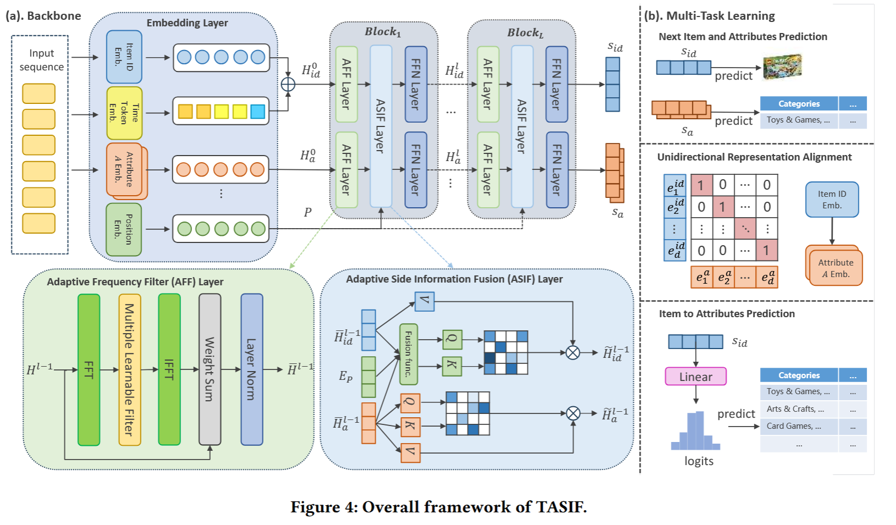

# 【SR】Time-Aware Adaptive Side Information Fusion for Sequential Recommendation

用于顺序推荐的时间感知自适应辅助信息融合

## 摘要

将商品方面的信息（例如类别和品牌）纳入顺序推荐中是一种行之有效的提高绩效的方法。

它们经常忽视时间戳中固有的细粒度时间动态，在用户交互序列中表现出容易受到噪声影响，并且依赖于计算成本高昂的融合架构。

为了系统地应对这些挑战，我们提出了**时间感知自适应辅助信息融合（TASIF）框架。**

(1) 一种简单的、即插即用的时间跨度分区机制来捕获全局时间模式；

（2）自适应频率滤波器，利用可学习门对特征序列进行自适应去噪，从而为后续融合模块提供更高质量的输入；

（3）高效的自适应辅助信息融合层，该层采用“引导而非混合”架构，其中属性引导注意力机制，而不混合到表示内容的项目嵌入中，在保证计算效率的同时确保深度交互。

## 引言

虽然顺序推荐已经取得了显着的进步，但现有方法仍然受到严重依赖项目 ID 建模的限制，同时未充分利用用户行为序列中丰富的辅助信息（例如类别、品牌）。

NOVA [11] 首创了“非侵入式”注意力，仅使用属性信息进行注意力权重计算，同时保留 ID 嵌入作为独立值以防止信息污染。

然而，在追求性能的过程中，这些先进的**辅助信息融合**模型表现出越来越复杂的结构设计，这反过来又暴露了几个基本限制：

**（1）对时间动态的系统性忽视。**大多数先进的融合模型在很大程度上忽视了嵌入精确时间戳中的丰富动态模式的有效建模。尽管存在专用的时间感知模型，但它们要么专注于细粒度的项目间间隔（例如，TiSASRec [9]），要么设计复杂的时间感知注意力结构（例如，TimelyRec [1]），使得它们集成到已经臃肿的融合框架中是不切实际的。同时，将时间戳视为另一条辅助信息（例如 DLFS-Rec [12]）无法捕获其独特的全局上下文信息；

**(2) 特征序列中噪声的次优处理。**

**(3)融合机制本身的效率瓶颈。**为了最大限度地利用辅助信息，一些模型采用计算密集型跨序列注意力（例如，图 3（c）所示的 MSSR [10]），而其他模型则采用并行双融合路径（例如，图 3（d）所示的 DIFF [6]）。尽管这些设计提高了性能，但它们引入了大量的计算开销，限制了它们在实际应用中的潜力。

> ## 2）(a) NOVA：先融合表示，再算一套注意力（value 保持独立）
>
> - **做法**：先把 **ID 和 A 融合**成一个表征，再用它生成注意力（Q/K），做自注意力更新。
> - **特点**：图注说它强调 **value independence**：直觉上就是尽量别让属性把 value 路径“搅浑”，更像是用属性参与“注意力怎么分配”，但 value 信息相对保持“干净”。
>
> ------
>
> ## 3）(b) DIF-SR：注意力分开算，最后融合“注意力矩阵”
>
> - **做法**：对 **ID** 算一套 attention matrix；对 **A** 再算一套 attention matrix；再用 Fusion func 把这两个注意力矩阵融合，得到最终的注意力来更新表示。
> - **核心思想**：**不急着把 embedding 混在一起**，而是把“看谁更重要”（注意力权重）先分开学，再融合。
>
> ------
>
> ## 4）(c) MSSR：把“item 序列”和“属性序列”当成两条序列，做 intra + inter
>
> - **做法**：不仅各自做 **intra-seq attention（序列内自注意力）**，还做 **inter-seq attention（跨序列 cross-attention）**，即 item↔attr 互相看。
> - **代价**：表达力强，但通常**结构重、算力更贵**（多套 attention + 多条路径）。
>
> ------
>
> ## 5）(d) DIFF：双融合（dual-fusion）结构
>
> - **做法**：你可以把它理解成两条路径：
>   - 一条是“融合表示/特征”的路径；
>   - 另一条是“融合注意力/交互”的路径；
>      最后再合并输出。
> - **直觉**：希望两种融合都要（更强），但也意味着**更复杂/更耗**。
>
> ------
>
> ## 6）(e) TASIF：最关键——“属性只用来引导注意力，不直接参与 value 更新 item”
>
> 这是作者想强调的 **lightweight + 解耦**：
>
> - **Q、K**：来自 **融合后的表征**（ID + A → Fusion），也就是：
>   - 属性信息主要影响 **attention weights**（“该关注序列里的哪些位置”）
> - **V**：来自 **ID 路径**（蓝色的 V）
>   - 更新 item repr 时，value 仍以协同 ID 为主，避免属性直接“掺进”value 导致协同信号被稀释
>
> 同时右侧你还能看到 **Attr repr.** 那条支路：属性自己也形成表示（橙色注意力块），但它与 item 的更新是**解耦的**（不是硬混成一个 embedding）。
>
> > 一句话总结 TASIF：
> >  **attributes guide attention（管“怎么看”），ID carries value（管“怎么更新”）**。

## 相关工作

### 顺序推荐

SR 的目标是基于用户的历史交互序列来预测其未来兴趣/下一次最可能交互的物品；早期方法（如 FPMC）主要依赖马尔可夫链，但难以刻画复杂的长程依赖。随后深度学习推动了 SR 的突破：GRU4Rec 将 RNN 引入序列建模，Caser 与 NextItNet 分别用卷积与空洞卷积捕获序列模式；再往后，Transformer 成为新的关键进展，SASRec 用自注意力建模全局依赖，BERT4Rec 通过双向建模进一步增强表示能力。同时，为了更充分利用交互中的时间信息，研究者也探索了 time-aware SR，例如 TiSASRec 用时间间隔嵌入刻画兴趣漂移，TiCoSeRec 则用“时间同质化”的对比学习处理不规则的时间分布。

## 方法

> 这个方法叫 **TASIF**，主要用于**带侧信息的序列推荐**，也就是根据用户历史点击序列，同时利用物品类别、品牌、时间等信息，预测用户下一个可能交互的物品。
整体流程可以分成三步：
**第一步：Embedding 输入表示。**
输入是用户的历史交互序列，比如：
$$
[i_1,i_2,i_3,\dots,i_n]
$$
模型会分别构造四类向量：物品 ID 向量、时间 token 向量、属性向量、位置向量。其中物品 ID 和时间 token 相加，得到主序列表征：
$$
H_{id}^{0}
$$
属性信息单独形成属性表征：
$$
H_a^{0}
$$
**第二步：AFF 层做频域去噪。**
用户行为序列里可能有噪声，比如偶然点击、不稳定兴趣。AFF 层先用 FFT 把序列特征从时域变到频域，再用可学习滤波器过滤噪声，最后用 IFFT 变回原来的时域表示。它不是固定地丢掉高频信号，而是通过可学习权重自适应决定“过滤多少、保留多少”。
**第三步：ASIF 层做侧信息融合。**
这是方法的核心。它的思想是 **guide-not-mix**，也就是“属性只指导，不直接混入”。
具体来说，属性信息会参与 Query 和 Key 的计算，用来影响注意力权重；但是 Value 主要来自 item ID 表征，保证最终推荐仍然以物品 ID 的协同过滤信号为核心。这样既利用了类别、品牌等侧信息，又避免属性信息污染 item ID 表征。
最后，模型输出两个表示：
$$
s_{id}
$$
表示用户对物品 ID 的兴趣；
$$
s_a
$$
表示用户对属性的兴趣。
右侧的多任务学习包括三部分：预测下一个物品和属性、让 item ID 表征与属性表征单向对齐、用 item 表征预测属性。这样可以让属性表示学得更充分，从而提升推荐效果。
一句话总结：**TASIF = 时间 token 建模 + 频域自适应去噪 + 属性引导式融合，用较轻量的结构把时间信息和侧信息有效融入序列推荐。**

方法图左边的 Input sequence 指的是：某个用户的历史交互序列，也就是用户过去按时间顺序点击、购买、评分过的物品序列。
- Item ID Embedding:物品ID嵌入
- Time Token Embedding:交互的时间戳
- Attribute Embedding:物品侧信息（品牌、价格）
- Position Embedding:这是序列位置编码，表示物品在用户历史序列中的第几个位置。

### Embedding Layer
把离散的编号信息转换成模型能处理的连续向量。在推荐系统里，原始输入不是天然的向量，而是一堆离散 ID，比如物品 ID、类别 ID、时间 token ID、位置编号，所以要先通过 embedding lookup 查表，把它们变成向量.
给定用户的交互序列 $S_u$ 及其对应的时间 token 序列 $S_u^\tau$，我们首先进行嵌入查找，以获得初始向量序列。主物品表示 $H_{id}^{0}$ 通过融合物品 ID 信息和时间 token 信息构造得到：
$$
H_{id}^{0}=\text{LayerNorm}(E_{ID}(S_u)+E_T(S_u^\tau))
$$
其中，$E_{ID}(S_u)$ 和 $E_T(S_u^\tau)$ 分别表示物品 ID 嵌入序列和时间 token 嵌入序列。随后，对 $H_{id}^{0}$ 应用 dropout 层以进行正则化。

类似地，对于每一种属性类型 $A_j\in \mathcal{A}$，我们生成对应的属性嵌入序列：
$$
H_{a_j}^{0}=E_{A_j}(S_u)
$$

### Adaptive Information Filter and Fusion
该模块由多个 Transformer 块组成。每个 Transformer 块包括自适应频率滤波器 (AFF) 层、自适应侧信息融合 (ASIF) 层和前馈网络 (FFN) 层。
嘈杂的用户行为序列会对顺序推荐产生负面​​影响，尤其是在基于注意力的模型中. 为了解决这个问题，最近的方法结合了频域分析来对项目表示进行降噪.

我们在每个自适应辅助信息融合层之前引入了一个自适应频率滤波器层，它放弃了原始的残差连接结构，而是采用自适应加权方法将原始特征与频域处理后的特征合并。

使用快速傅里叶变换（FFT），我们首先在第 $l$ 个块中将输入隐藏状态 $H^{l-1}$ 从时域转换到频域：
$$
H_x^{l-1}=\text{FFT}(H^{l-1}),
$$
其中，$H^{l-1}$ 统一表示隐藏状态 $H_{id}^{l-1}$ 和 $H_{a_j}^{l-1}$，而 $H_x^{l-1}$ 是一个复数张量，表示 $H^{l-1}$ 在频域中的频谱。接下来，应用一个可学习滤波器 $W\in \mathbb{R}^{n\times d}$ 来调制该频谱：
$$
\tilde{H}_x^{l-1}=W\odot H_x^{l-1},
$$
其中，$\odot$ 表示逐元素相乘。随后，经过调制后的频谱 $\tilde{H}_x^{l-1}$ 通过逆快速傅里叶变换（IFFT）被转换回时域，并对所得特征应用 dropout。引入一个可学习的权重参数 $\alpha$，其中 $0<\alpha<1$，用于动态调整频域滤波后特征的保留比例。最后，通过层归一化得到去噪后的嵌入表示：
$$
\bar{H}^{l-1}=\text{LayerNorm}\left(\alpha\cdot \text{Dropout}(\text{IFFT}(\tilde{H}_x^{l-1}))+(1-\alpha)\cdot H^{l-1}\right).
$$
这种设计使模型能够根据不同场景自适应地调整频域滤波强度，在抑制噪声的同时保留有用的高频特征。