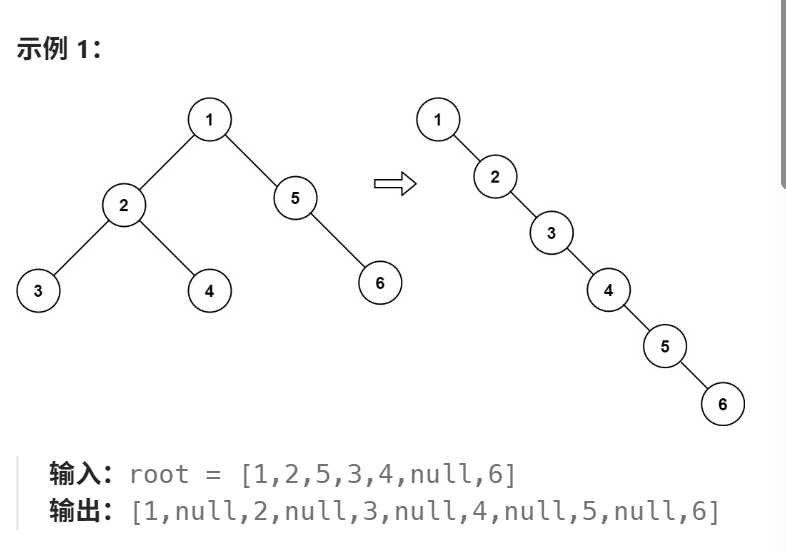

# **114. 二叉树展开为链表**

给你二叉树的根节点 `root`，请你将它展开为一个单链表：

- 展开后的单链表应该同样使用 `TreeNode`，其中 `right` 子指针指向链表中下一个结点，而左子指针始终为 `null`。
- 展开后的单链表应该与二叉树先序遍历顺序相同。
### 示例1



## 算法设计
采用**原地修改指针**的方式，将二叉树按照前序遍历顺序展开为单链表。

具体过程如下：

1. 使用 `curr` 从根节点开始，沿着右指针不断向后遍历。

2. 当 `curr` 没有左子树时，直接移动到 `curr->right`。

3. 当 

   ```
   curr
   ```

    存在左子树时：

   - 用 `next` 保存左子树的根节点。
   - 找到左子树中最右侧的节点 `pre`。
   - 将当前节点原来的右子树接到 `pre->right`。
   - 将左子树整体移动到当前节点的右侧。
   - 将当前节点的左指针设为 `nullptr`。

4. 继续处理新的右子节点，直到遍历结束。

核心指针变化为：

```
pre->right = curr->right;  // 原右子树接到左子树末尾
curr->right = curr->left;  // 左子树移动到右侧
curr->left = nullptr;      // 清空左指针
```

这样能够保证展开顺序为：

```
根节点 → 左子树 → 右子树
```

也就是二叉树的前序遍历顺序。该算法不需要递归或额外栈，时间复杂度为 $O(n)$，空间复杂度为 $O(1)$

## 代码实现
```cpp
class Solution {
public:
    void flatten(TreeNode* root) {
        TreeNode * curr = root;
        while (curr != nullptr) {
            if (curr->left != nullptr) {
            auto next = curr->left;
            auto pre = next;
            while (pre->right != nullptr) {
                pre = pre->right;
            }
            pre->right = curr->right;
            curr->left = nullptr;
            curr->right = next;
            }
            curr = curr->right;
        }
    }
};
```