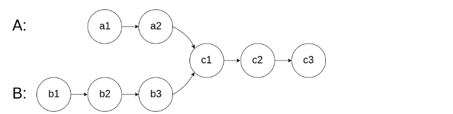
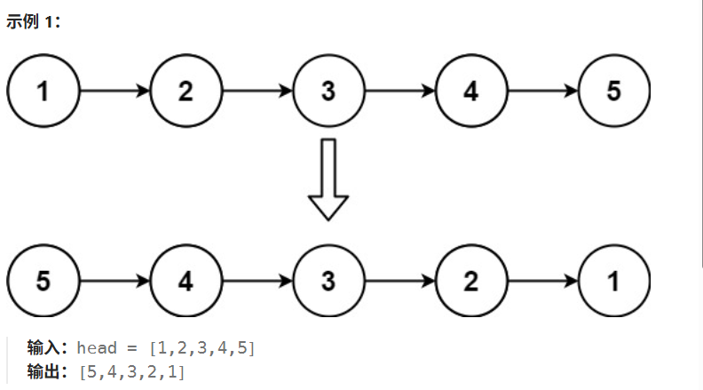
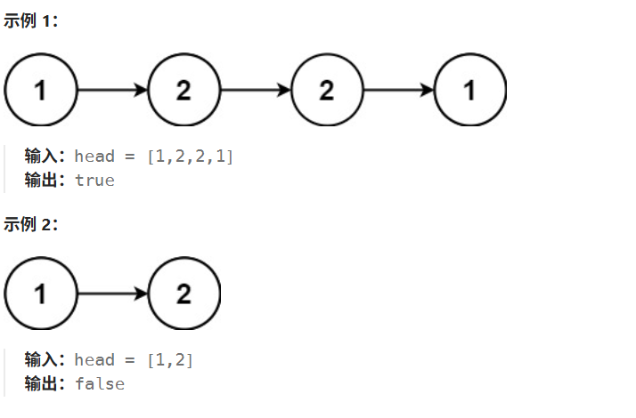

# 160. 相交链表
给你两个单链表的头节点 headA 和 headB ，请你找出并返回两个单链表相交的起始节点。如果两个链表不存在相交节点，返回 null 。

图示两个链表在节点 c1 开始相交：


## 算法设计
用哈希
判断两个链表是否相交，可以使用哈希集合存储链表节点。

首先遍历链表 headA，并将链表 headA 中的每个节点加入哈希集合中。然后遍历链表 headB，对于遍历到的每个节点，判断该节点是否在哈希集合中：

## 代码实现

```cpp
class Solution {
public:
    ListNode *getIntersectionNode(ListNode *headA, ListNode *headB) {
        unordered_set<ListNode*> v;
        ListNode *temp = headA;
        while (temp != nullptr) {
            v.insert(temp);
            temp = temp->next;
        }
        temp = headB;
        while(temp != nullptr) {
            if (v.count(temp)) {
                return temp;
            }
            temp = temp->next;
        }
        return nullptr;
    }
};
```

# 206. 反转链表
给你单链表的头节点 head ，请你反转链表，并返回反转后的链表。



## 算法设计
在遍历链表时，将当前节点的 next 指针改为指向前一个节点。由于节点没有引用其前一个节点，因此必须事先存储其前一个节点。在更改引用之前，还需要存储后一个节点。最后返回新的头引用。

## 代码实现
```cpp
class Solution {
public:
    ListNode* reverseList(ListNode* head) {
        ListNode* prev = nullptr;
        ListNode* curr = head;
        while (curr != nullptr) {
            ListNode * next = curr->next;
            curr->next = prev;
            prev = curr;
            curr = next;
        }
        return prev;
    }
};
```


# 234. 回文链表
给你一个单链表的头节点 head ，请你判断该链表是否为回文链表。如果是，返回 true ；否则，返回 false 。

## 算法设计
把数据复制到数组，然后双指针遍历数组

## 代码实现
```cpp
class Solution {
public:
    bool isPalindrome(ListNode* head) {
        // 把数据复制到数组，然后双指针遍历数组
        vector<int> a;
        while (head != nullptr) {
            a.push_back(head->val);
            head = head->next;
        }
        for (int i = 0, j = a.size() - 1; i < j; i ++, j -- )
        {
            if (a[i] != a[j]) return false;
        }
        return true;
    }
};
```