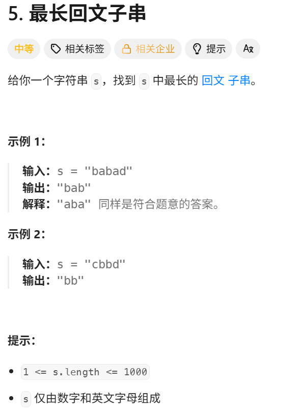
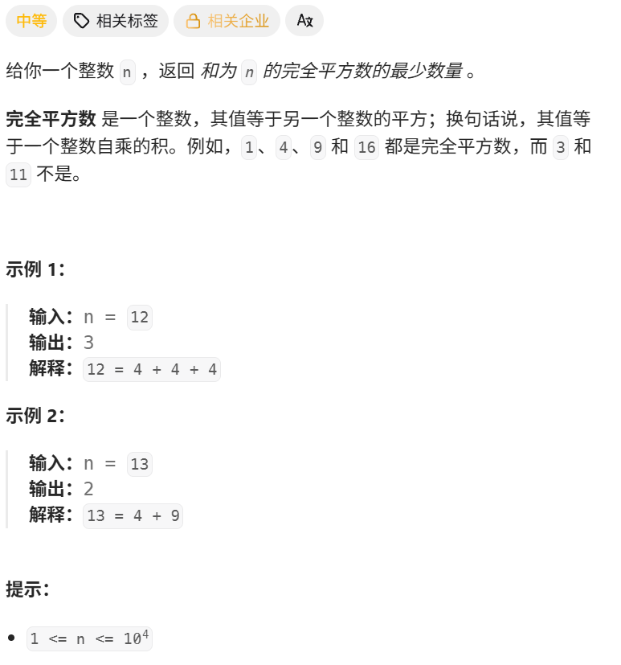
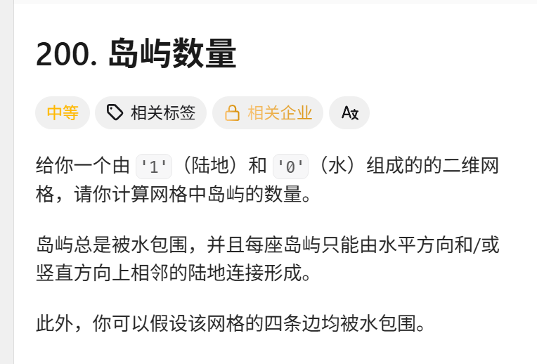
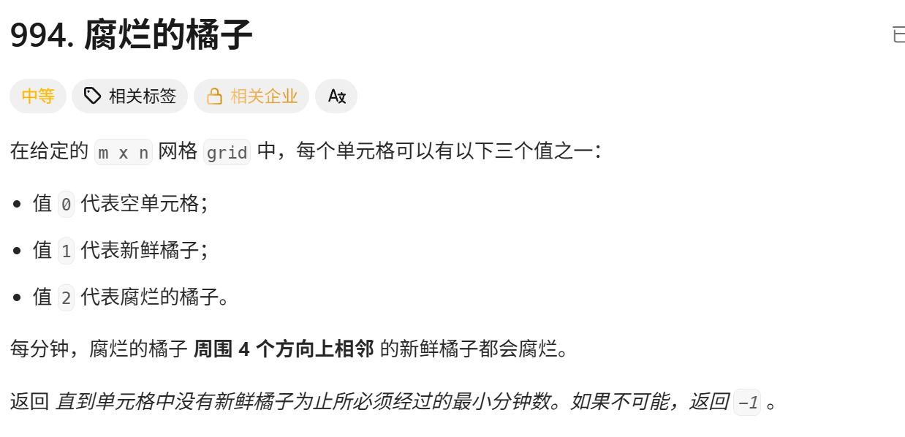
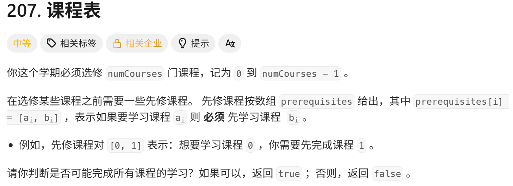

# 5. 最长回文子串


## 算法设计

### 1. 算法思路

定义：

```
dp[i][j]
```

表示字符串 `s[i...j]` 是否为回文子串。

核心思想：如果一个字符串的**首尾字符相同**，并且**中间部分也是回文串**，那么整个字符串就是回文串。

### 2. 状态转移

当 `s[i] != s[j]`：

dp[i][j]=false

当 `s[i] == s[j]`：

- 若子串长度 `≤ 3`，直接是回文串；
- 若子串长度 `> 3`，则取决于内部子串 `s[i+1...j-1]`。

即：

dp[i][j]=⎩⎨⎧false,true,dp[i+1][j−1],s[i]\\=s[j]s[i]=s[j] 且 j−i<3s[i]=s[j] 且 j−i≥3

例如：

```
"abba"
 ↓  ↓
 a == a

只需要继续判断内部 "bb" 是否为回文串。
```

### 3. 初始化

单个字符一定是回文串：

```
dp[i][i] = true;
```

同时：

```
maxLen = 1;
begin = 0;
```

分别记录当前最长回文串的**长度**和**起始位置**。

### 4. 遍历顺序

按照**子串长度从小到大**枚举：

```
for (int L = 2; L <= n; L++)
```

再枚举左端点 `i`，计算右端点：

```
j = i + L - 1;
```

必须先计算短子串，因为：

```
dp[i][j]
```

依赖：

```
dp[i + 1][j - 1]
```

所以要保证内部较短的子串已经计算完成。

### 5. 更新答案

如果当前 `s[i...j]` 是回文串，并且长度更长：

```
if (dp[i][j] && j - i + 1 > maxLen) {
    maxLen = j - i + 1;
    begin = i;
}
```

最后：

```
return s.substr(begin, maxLen);
```

### 6. 复杂度

- **时间复杂度：O(n2)**：需要枚举所有可能的左右端点。
- **空间复杂度：O(n2)**：使用二维 `dp` 数组保存所有子串状态。

### 一句话总结

**用 `dp[i][j]` 表示 `s[i...j]` 是否回文，根据“首尾相等 + 内部回文”进行状态转移，并按子串长度从小到大计算，最终记录最长回文子串。**

## 代码实现
```cpp
class Solution {
public:
    string longestPalindrome(string s) {
        // dp[i][j] 表示i到j是否是回文子串
        int n = s.length();
        vector<vector<int>> dp(n, vector<int>(n)); 
        // 长度小于2都是回文子串
        if (n < 2) return s;
        // 长度为2，两个相同是回文子串
        for (int i = 0; i < n; i ++) {
            dp[i][i] = true; // 单个字母是回文子串
        }
        int maxLen = 1;
        int begin = 0;
        for (int L = 2; L <= n; L ++)
        {   // 枚举左边界
            for (int i = 0; i < n; i ++)
            {
                int j = L + i - 1;
                if (j >= n) break;
                if (s[i] != s[j]) dp[i][j] = false;
                else {
                    if (j - i < 3) {
                        dp[i][j] = true;
                    }else {
                        dp[i][j] = dp[i + 1][ j - 1];
                    }
                } 
                if (dp[i][j] && j - i + 1 >maxLen) {
                maxLen = j - i + 1;
                begin = i;
            }
            }

        }
        return s.substr(begin, maxLen);
    }
};
```

# 279. 完全平方数


## 算法设计
定义 dp[i] 表示组成整数 i 所需要的最少完全平方数个数，初始化 dp[0]=0，其余状态设为无穷大。对于每个 i，枚举所有满足 jj=i 的完全平方数 j²，假设最后选择 j²，则剩余部分为 i-j²，因此状态转移为 dp[i].md
## 代码实现
```cpp
class Solution {
public:
    int numSquares(int n) {
        vector<int> dp(n + 1, INT_MAX);

        dp[0] = 0;

        for (int i = 1; i <= n; i++) {
            for (int j = 1; j * j <= i; j++) {
                dp[i] = min(dp[i], dp[i - j * j] + 1);
            }
        }

        return dp[n];
    }
};
```

## 图论
### 岛屿数量

```cpp
class Solution {
private:
    void dfs(vector<vector<char>>& grid, int r, int c) {
        int nr = grid.size();
        int nc = grid[0].size();

        grid[r][c] = '0';
        if (r - 1 >= 0 && grid[r-1][c] == '1') dfs(grid, r - 1, c);
        if (r + 1 < nr && grid[r+1][c] == '1') dfs(grid, r + 1, c);
        if (c - 1 >= 0 && grid[r][c-1] == '1') dfs(grid, r, c - 1);
        if (c + 1 < nc && grid[r][c+1] == '1') dfs(grid, r, c + 1);
    }

public:
    int numIslands(vector<vector<char>>& grid) {
        int nr = grid.size();
        if (!nr) return 0;
        int nc = grid[0].size();

        int num_islands = 0;
        for (int r = 0; r < nr; ++r) {
            for (int c = 0; c < nc; ++c) {
                if (grid[r][c] == '1') {
                    ++num_islands;
                    dfs(grid, r, c);
                }
            }
        }

        return num_islands;
    }
};

```

### 腐烂的橘子

```cpp
class Solution {
public:
    int dist[10][10];
    int dx[4] = {-1, 0, 1, 0};
    int dy[4] = {0, 1, 0, -1};
    int orangesRotting(vector<vector<int>>& grid) {
        int n = grid.size();
        int m = grid[0].size();
        memset(dist, -1, sizeof dist);
        int cnt = 0, ans = 0;
        queue<pair<int, int>> q;
        for (int i = 0; i < n; i ++ )
        {
            for (int j = 0; j < m; j ++)
            {
                if (grid[i][j] == 2) {
                    q.push({i, j});
                    dist[i][j] = 0;
                }
                else if (grid[i][j] == 1) {
                    cnt ++;
                }
            }
        }
        while(q.size())
        {
            auto u = q.front();
            q.pop();
            for (int i = 0; i < 4; i ++)
            {
                int a = u.first + dx[i];
                int b = u.second + dy[i];
                if (a < 0 || b < 0 || a >= n || b >= m) continue;
                // 只能感染新鲜橘子
                if (grid[a][b] != 1)
                    continue;
                dist[a][b] = dist[u.first][u.second] + 1;
                q.push({a, b});
                if (grid[a][b] == 1) {
                    cnt -= 1;
                    grid[a][b] = 2;
                    ans = dist[a][b];
                    if (!cnt) {
                        break;
                    }
                }
            }
        }
        return cnt ? -1 : ans;
    }
};
```


### 课程表

```cpp
class Solution {
private:
    vector<vector<int>> edges;
    vector<int> visited;
    bool valid = true;

public:
    void dfs(int u) {
        visited[u] = 1;
        for (int v: edges[u]) {
            if (visited[v] == 0) {
                dfs(v);
                if (!valid) {
                    return;
                }
            }
            else if (visited[v] == 1) {
                valid = false;
                return;
            }
        }
        visited[u] = 2;
    }

    bool canFinish(int numCourses, vector<vector<int>>& prerequisites) {
        edges.resize(numCourses);
        visited.resize(numCourses);
        for (const auto& info: prerequisites) {
            edges[info[1]].push_back(info[0]);
        }
        for (int i = 0; i < numCourses && valid; ++i) {
            if (!visited[i]) {
                dfs(i);
            }
        }
        return valid;
    }
};

```