# 力扣一百合集
## 必备头文件
```cpp
#include <iostream>      // cin, cout
#include <vector>        // vector
#include <string>        // string
#include <algorithm>     // sort, max, min, reverse
#include <queue>         // queue, priority_queue
#include <stack>         // stack
#include <deque>         // deque
#include <set>           // set, multiset
#include <map>           // map, multimap
#include <unordered_set> // unordered_set
#include <unordered_map> // unordered_map
#include <cmath>         // sqrt, pow, abs
#include <climits>       // INT_MAX, INT_MIN
#include <utility>   // pair, make_pair
#include <cstring>   // memset

#include <bits/stdc++.h>
using namespace std;

// 默认是大顶堆
priority_queue<int> max_heap;

// 小顶堆定义方式
priority_queue<int, vector<int>, greater<int>> min_heap;
```

## 哈希
### 两数之和
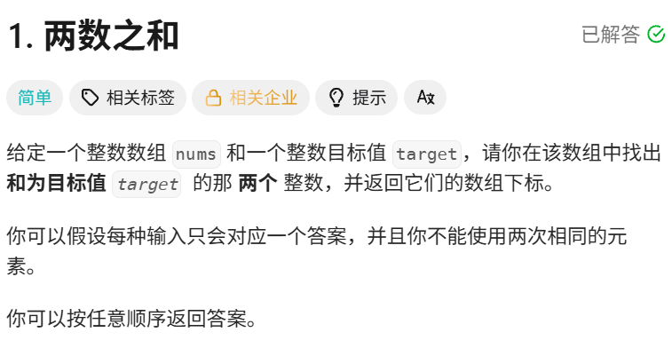
```cpp
class Solution {
public:
    vector<int> twoSum(vector<int>& nums, int target) {
        int n = nums.size();
        vector<int> ans;
        bool flag = true;
        for(int i = 0; i < n && flag; i ++) {
            for (int j = 0; j < n && flag;j ++){
                if (i == j) continue;
                if (nums[i] + nums[j] == target){
                    ans.push_back(i);
                    ans.push_back(j);
                    flag = false;
                    break;
                }
            }
        }
        return ans;
    }
};
```

### 49. 字母异位词分组
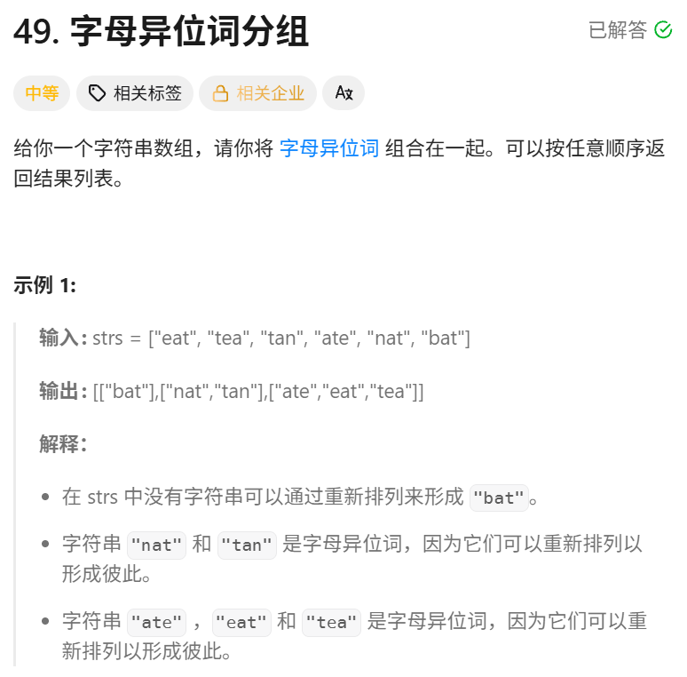
```cpp
class Solution {
public:
    vector<vector<string>> groupAnagrams(vector<string>& strs) {
        unordered_map<string, vector<string>> m;
        for (string &s : strs) {
            string s2 = s;
            sort(s2.begin(), s2.end());
            m[s2].push_back(s); // 排序后相同的分到一起
        }
        vector<vector<string>> ans;
        for (auto it = m.begin(); it != m.end(); it ++) {
            vector<string> g = it->second;
            ans.push_back(g);
        }
        return ans;
    }
};
```

### 128. 最长连续序列
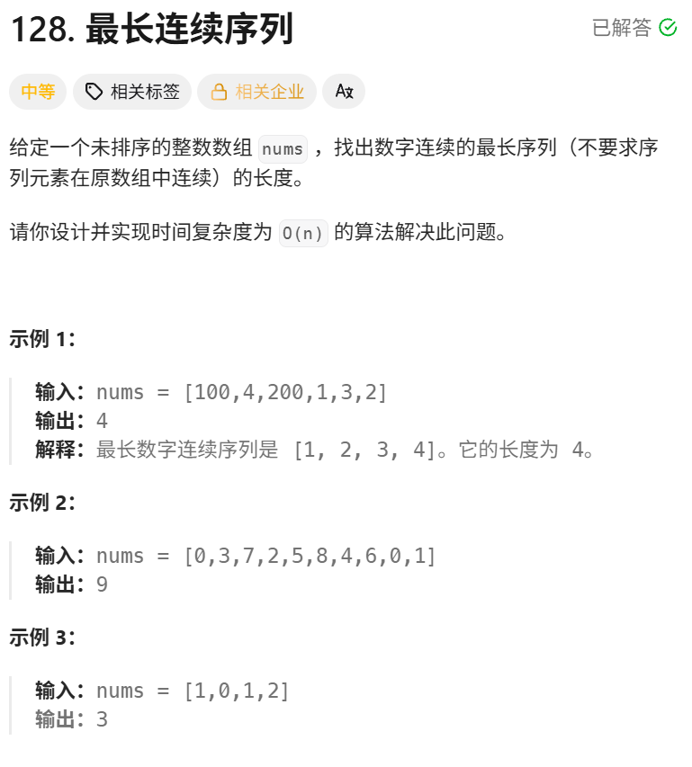
```cpp
class Solution {
public:
    int longestConsecutive(vector<int>& nums) {
        unordered_set<int> num_set;
        for (int num : nums) {
            num_set.insert(num);
        }
        int ans = 0;
        for (int num : num_set) {
            // 如果 num - 1不存在，num为序列的起点
            if (!num_set.count(num - 1)) {
                int curNum = num;
                int curL = 1;
                while(num_set.count(curNum + 1)) {
                    curNum ++;
                    curL ++;
                }
                ans = max(ans, curL);
            }
        }
        return ans;
    }
};
```


## 双指针
### 283. 移动零
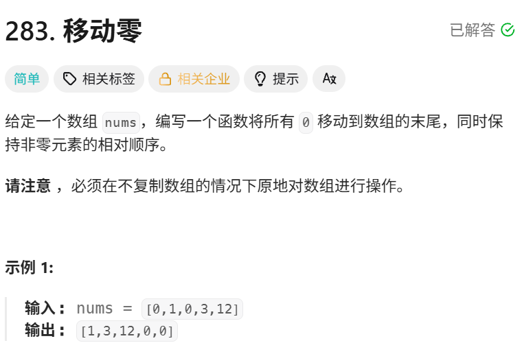
```cpp
class Solution {
public:
    void moveZeroes(vector<int>& nums) {
        // 双指针
        int j = 0;
        for (int i = 0;i < nums.size();i ++) {
            if (nums[i] != 0) {
                nums[j] = nums[i];
                j ++;
            }
        }
        while (j < nums.size()) {
            nums[j] = 0;
            j ++;
        }
    }
};
```

### 11. 盛最多水的容器
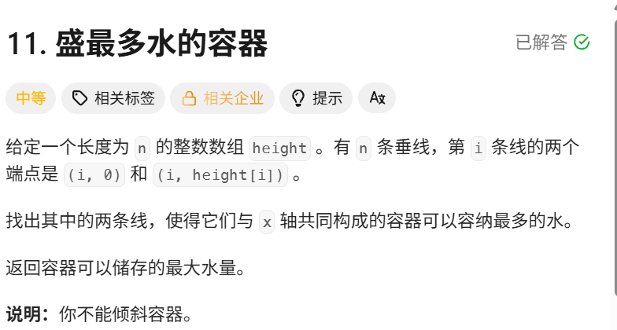
```cpp
class Solution {
public:
    int maxArea(vector<int>& height) {
        int j = height.size()-1;
        int i = 0;
        int ans = 0;
        while(i <= j){
            int p = min(height[i], height[j]);
            int tp = p * (j - i);
            ans = max(ans, tp);
            if (height[i] < height[j]) {
                i ++;
            }
            else{
                j --;
            }
        }
        return ans;
    }
};
```


### 15.三数之和
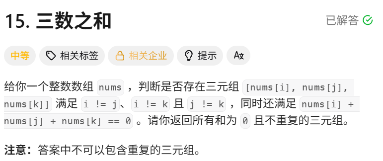
```cpp
class Solution {
public:
        /*
         * 思路：
         * 1. 先对数组排序，方便使用双指针并进行去重。
         * 2. 枚举第一个数 nums[i]，然后在右侧区间使用双指针 j、k。
         * 3. 如果三数之和 > 0，说明和太大，k 左移。
         * 4. 如果三数之和 < 0，说明和太小，j 右移。
         * 5. 如果三数之和 == 0，记录答案，并跳过重复元素。
         * 6. 对 i 也需要去重，避免产生重复三元组。
         * 7. 可以利用排序后的大小关系进行剪枝，减少无效搜索。
         *
         * 时间复杂度：O(n^2)
         */
    vector<vector<int>> threeSum(vector<int>& nums) {
        sort(nums.begin(), nums.end());
        vector<vector<int>> ans;
        int n = nums.size();
        for (int i = 0; i < n - 2; i ++ )
        {
            int x = nums[i];
            if (i && x == nums[i - 1]) continue; // 跳过重复数字
            if (x + nums[i + 1] + nums[i + 2] > 0) break;
            if (x + nums[n - 1] + nums[n - 2] < 0) continue;
            int j = i + 1, k = n - 1;
            while(j < k) {
                int s= x + nums[j] + nums[k];
                if (s > 0) {
                    k --;
                }
                else if (s < 0) {
                     j ++;
                }
                else{
                    ans.push_back({x, nums[j], nums[k]});
                    for (j ++; j < k && nums[j] == nums[j - 1]; j ++);
                    for (k-- ; k > j&& nums[k] == nums[k + 1]; k --);
                }
            }
        }
        return ans;
    }
};
```

### 42. 接雨水
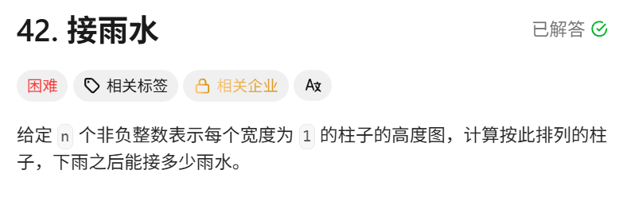
```cpp
class Solution {
public:
    int trap(vector<int>& height) {
        if (height.size() <= 2) return 0;
        int n = height.size();
        int l = 0, r = n -  1;
        int leftMax = 0, rightMax = 0;
        int ans = 0;
        while(l < r){
            leftMax = max(leftMax, height[l]);
            rightMax = max(rightMax, height[r]);
            if (leftMax < rightMax) {
                ans += leftMax - height[l];
                l ++;
            }
            else{
                ans += rightMax - height[r];
                r --;
            }
        }
        return ans;
    }
};
```

## 滑动窗口

### 无重复字符的最长子串
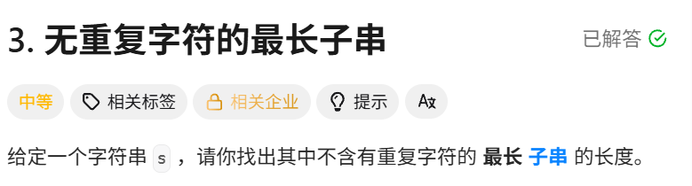
```cpp
class Solution {
public:
    int lengthOfLongestSubstring(string s) {
        // 用哈希表记录每个字符上一次出现的位置
        // 当发现当前字符在窗口中出现过，就把left移动到它上一次出现位置的最后一位
        unordered_map<char, int> last;
        int l = 0;
        int ans = 0;
        for (int r = 0; r < s.size(); r ++) 
        {
            char c = s[r];
            while (last.count(c) && last[c] >= l)
            {
                l = last[c] + 1;
            }
            last[c] = r;
            ans = max(ans, r - l + 1);
        }
        return ans;
    }
};
```


### 找到字符串中所有字母异位词
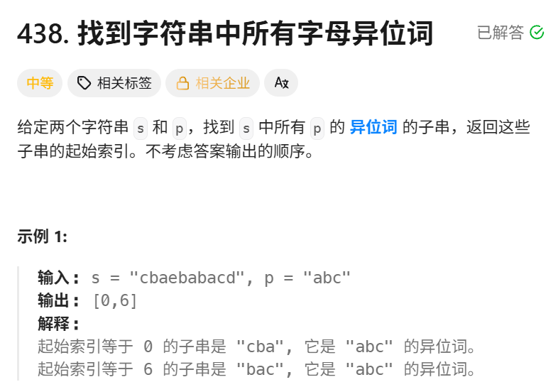
```cpp
class Solution {
public:
        /*
         * 思路：滑动窗口 + 字符计数
         * 1. 异位词只要求字符种类和每个字符出现次数相同，因此用长度为 26 的数组统计字符频率。
         * 2. 先统计 p 的字符频率 cntP，以及 s 中前 m 个字符组成窗口的频率 cntS。
         * 3. 如果 cntS == cntP，说明当前窗口是 p 的异位词，记录窗口起点。
         * 4. 之后窗口每次向右移动一格：
         *    - 加入右侧新字符 s[i]
         *    - 删除左侧移出的字符 s[i - m]
         * 5. 每次移动后比较 cntS 和 cntP，相同则记录当前窗口起点。
         */
    vector<int> findAnagrams(string s, string p) {
        int n = s.size(), m = p.size();
        vector<int> ans;
        if (n < m ) return ans;
        vector<int> cntS(26, 0);
        vector<int> cntP(26, 0);
        for (int i = 0; i < m; i ++)
        {
            cntS[s[i] - 'a'] ++;
            cntP[p[i] - 'a'] ++;
        }
        if (cntS == cntP) ans.push_back(0);
        for (int i = m; i < n; i ++)
        {
            cntS[s[i] - 'a'] ++;
            cntS[s[i - m] - 'a'] --;
            if (cntS == cntP) ans.push_back(i - m + 1);
        }
        return ans;

    }   
};
```


## 子串
### 和为 K 的子数组
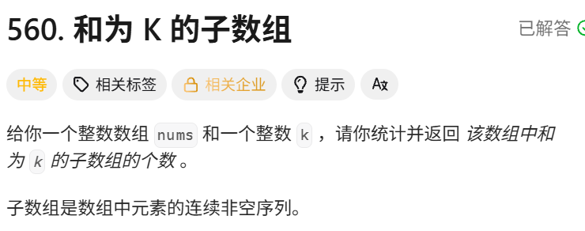
```cpp
class Solution {
public:  /*
         * 1. 设当前前缀和为 sum。
         * 2. 如果之前存在一个前缀和为 sum - k，
         *    那么这两个前缀和之间的子数组之和一定为 k：
         *
         *        sum - (sum - k) = k
         *
         * 3. 用哈希表 mp 记录每个前缀和出现了多少次。
         * 4. 每遍历一个数字：
         *    - 更新当前前缀和 sum
         *    - 查找 sum - k 出现了多少次
         *    - 出现几次，就说明当前有几个满足条件的子数组
         *    - 最后记录当前 sum 的出现次数
         *
         * mp[0] = 1 很重要：
         * 表示在数组开始之前存在一个前缀和 0，
         * 这样当 sum == k 时，也能统计从下标 0 开始的子数组。
         *
         */
    int subarraySum(vector<int>& nums, int k) {
        unordered_map<int, int> mp;
        mp[0] = 1;
        int ans = 0;
        int sum = 0;
        for (int x : nums)
        {
            sum += x;
            if (mp.count(sum - k))
            {
                ans += mp[sum - k];
            }
            mp[sum] += 1;
        }
        return ans;
    }
};
```

### 239.滑动窗口最大值
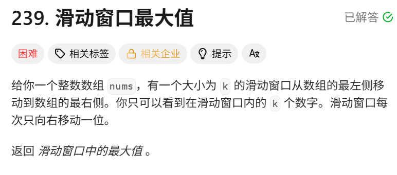
```cpp
class Solution {
public:
        /*
         * 思路：大根堆
         * 用优先队列保存 {数值, 下标}，堆顶始终是当前最大值。
         * 每次窗口右移时加入新元素，并把已经滑出窗口的堆顶元素删除。
         * 此时堆顶就是当前窗口的最大值。
         */
    vector<int> maxSlidingWindow(vector<int>& nums, int k) {
        int n = nums.size();
        priority_queue<pair<int, int>> q;
        for (int i = 0; i < k; ++i) {
            q.emplace(nums[i], i);
        }
        vector<int> ans = {q.top().first};
        for (int i = k; i < n; ++i) {
            q.emplace(nums[i], i);
            while (q.top().second <= i - k) {
                q.pop();
            }
            ans.push_back(q.top().first);
        }
        return ans;
    }
};

```


## 矩阵
### 矩阵置零
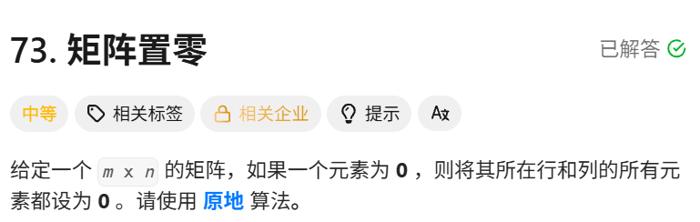
```cpp
class Solution {
public:
            /*
         * 思路：额外数组标记
         * 先遍历矩阵，记录哪些行和哪些列出现了 0。
         * 再次遍历矩阵，只要当前位置所在行或列被标记，就将其置为 0。
         */
    void setZeroes(vector<vector<int>>& matrix) {
        int m = matrix.size();
        int n = matrix[0].size();
        vector<int> row(m), col(n);
        for (int i = 0; i < m; i++) {
            for (int j = 0; j < n; j++) {
                if (!matrix[i][j]) {
                    row[i] = col[j] = true;
                }
            }
        }
        for (int i = 0; i < m; i++) {
            for (int j = 0; j < n; j++) {
                if (row[i] || col[j]) {
                    matrix[i][j] = 0;
                }
            }
        }
    }
};

```

### 54. 螺旋矩阵
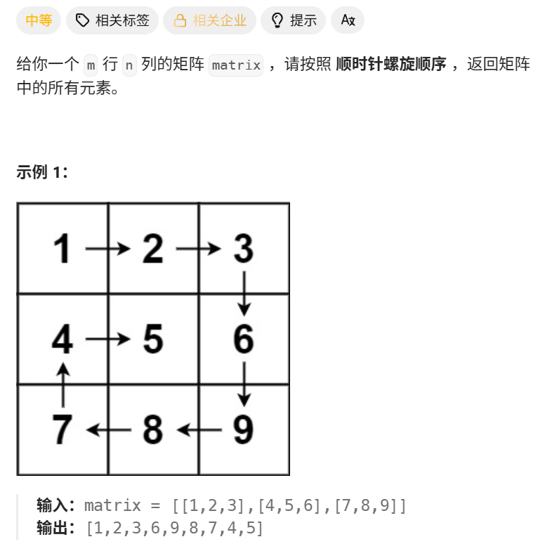
```cpp
class Solution {
private:
    static constexpr int directions[4][2] = {{0, 1}, {1, 0}, {0, -1}, {-1, 0}};
public:
    vector<int> spiralOrder(vector<vector<int>>& matrix) {
        if (matrix.size() == 0 || matrix[0].size() == 0) {
            return {};
        }
        
        int rows = matrix.size(), columns = matrix[0].size();
        vector<vector<bool>> visited(rows, vector<bool>(columns));
        int total = rows * columns;
        vector<int> order(total);

        int row = 0, column = 0;
        int directionIndex = 0;
        for (int i = 0; i < total; i++) {
            order[i] = matrix[row][column];
            visited[row][column] = true;
            int nextRow = row + directions[directionIndex][0], nextColumn = column + directions[directionIndex][1];
            if (nextRow < 0 || nextRow >= rows || nextColumn < 0 || nextColumn >= columns || visited[nextRow][nextColumn]) {
                directionIndex = (directionIndex + 1) % 4;
            }
            row += directions[directionIndex][0];
            column += directions[directionIndex][1];
        }
        return order;
    }
};

```


### 48.旋转图像
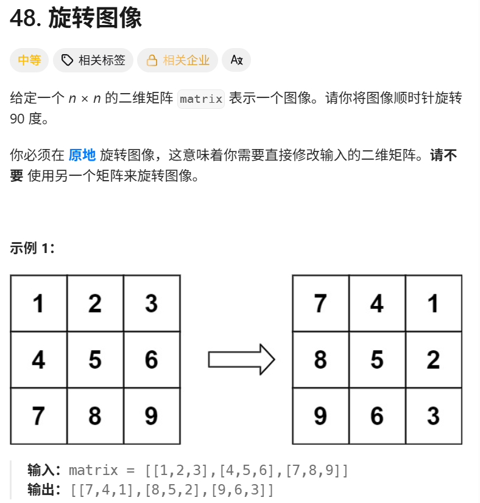
```cpp
class Solution {
public:
    void rotate(vector<vector<int>>& matrix) {
        int n = matrix.size();
        // C++ 这里的 = 拷贝是值拷贝，会得到一个新的数组
        auto matrix_new = matrix;
        for (int i = 0; i < n; ++i) {
            for (int j = 0; j < n; ++j) {
                matrix_new[j][n - i - 1] = matrix[i][j];
            }
        }
        // 这里也是值拷贝
        matrix = matrix_new;
    }
};
```

## 链表
### 160. 相交链表
给你两个单链表的头节点 headA 和 headB ，请你找出并返回两个单链表相交的起始节点。如果两个链表不存在相交节点，返回 null 。

图示两个链表在节点 c1 开始相交：


```cpp
class Solution {
public:
    ListNode *getIntersectionNode(ListNode *headA, ListNode *headB) {
        unordered_set<ListNode*> v;
        ListNode *temp = headA;
        while (temp != nullptr) {
            v.insert(temp);
            temp = temp->next;
        }
        temp = headB;
        while(temp != nullptr) {
            if (v.count(temp)) {
                return temp;
            }
            temp = temp->next;
        }
        return nullptr;
    }
};
```

### 206. 反转链表
给你单链表的头节点 head ，请你反转链表，并返回反转后的链表。


在遍历链表时，将当前节点的 next 指针改为指向前一个节点。由于节点没有引用其前一个节点，因此必须事先存储其前一个节点。在更改引用之前，还需要存储后一个节点。最后返回新的头引用。

```cpp
class Solution {
public:
    ListNode* reverseList(ListNode* head) {
        ListNode* prev = nullptr;
        ListNode* curr = head;
        while (curr != nullptr) {
            ListNode * next = curr->next;
            curr->next = prev;
            prev = curr;
            curr = next;
        }
        return prev;
    }
};
```


### 234. 回文链表
给你一个单链表的头节点 head ，请你判断该链表是否为回文链表。如果是，返回 true ；否则，返回 false 。


把数据复制到数组，然后双指针遍历数组
```cpp
class Solution {
public:
    bool isPalindrome(ListNode* head) {
        // 把数据复制到数组，然后双指针遍历数组
        vector<int> a;
        while (head != nullptr) {
            a.push_back(head->val);
            head = head->next;
        }
        for (int i = 0, j = a.size() - 1; i < j; i ++, j -- )
        {
            if (a[i] != a[j]) return false;
        }
        return true;
    }
};
```

### 24.两两交换链表中的节点
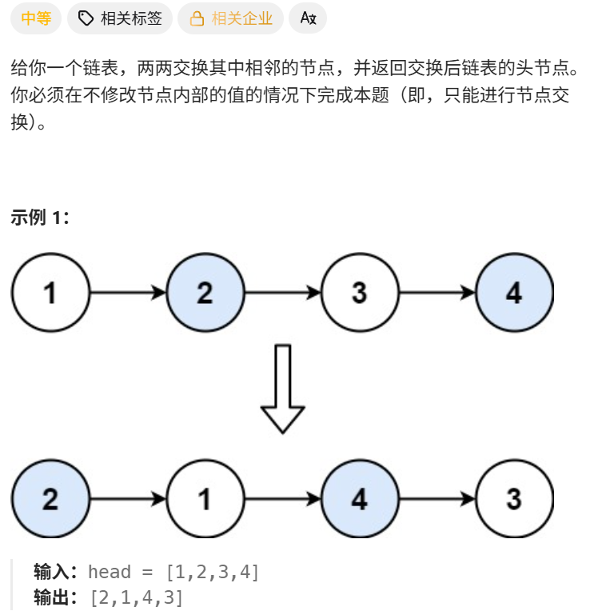
```cpp
class Solution {
public:
    ListNode* swapPairs(ListNode* head) {
        if (head == nullptr || head->next == nullptr) {
            return head;
        }
        ListNode* newHead = head->next;
        head->next = swapPairs(newHead->next);
        newHead->next = head;
        return newHead;
    }
};
```

## 二叉树
### **94. 二叉树的中序遍历**

给定一个二叉树的根节点 `root`，返回它的中序遍历。

```cpp
class Solution {
public:
    void dfs(TreeNode *u, vector<int> &ans)
    {
        if (u == nullptr) return ;
        dfs(u->left, ans);
        ans.push_back(u->val);
        dfs(u->right, ans);
    }
    vector<int> inorderTraversal(TreeNode* root) {
        vector<int> ans;
        dfs(root, ans);
        return ans;
    }
};
```


### **226. 翻转二叉树**

给你一棵二叉树的根节点 `root`，翻转这棵二叉树，并返回其根节点。
 
算法思路

使用递归，对于一个节点，交换他的左孩子指针和右孩子指针就行。


```cpp
class Solution {
public:
    void dfs(TreeNode* u)
    {
        if (u == nullptr) return ;
        swap(u->left, u->right);
        dfs(u->left);
        dfs(u->right);
    }
    TreeNode* invertTree(TreeNode* root) {
        if (root == nullptr) return root;
        dfs(root);
        return root;
    }
};
```


### **101. 对称二叉树**

给你一个二叉树的根节点 `root`，检查它是否轴对称

算法设计

用层序遍历，然后并行访问左边的左边和右边的右边，
判断是否相等就行。


```cpp
class Solution {
public:
    bool isSymmetric(TreeNode* root) {
        if (root == nullptr) return true;
        queue<TreeNode *> q1, q2;
        if (root  -> left == nullptr && root->right == nullptr) return true;
        if (root  -> left == nullptr || root->right == nullptr) return false;
        q1.push(root->left);
        q2.push(root->right);
        while(q1.size() || q2.size())
        {
            auto u = q1.front();
            auto v = q2.front();
            q1.pop(); q2.pop();
            if (u == nullptr && v == nullptr) continue;
            if (u == nullptr || v == nullptr) return false;
            if (u -> val != v->val ) return false;
            q1.push(u->left);
            q2.push(v->right);
            q1.push(u->right);
            q2.push(v->left);
        }
        return true;
    }
};
```


### **543. 二叉树的直径**

给你一棵二叉树的根节点，返回该树的直径。

二叉树的**直径**是指树中任意两个节点之间最长路径的**长度**。这条路径可能经过也可能不经过根节点 `root`。

两节点之间路径的**长度**由它们之间边数表示。

算法设计

递归计算每个节点左右子树的高度，并用“左子树高度 + 右子树高度”更新最大直径；最后向父节点返回当前子树的最大高度。时间复杂度为 O(n)，空间复杂度为 O(h)。

```cpp
class Solution {
public:
    int ans = 0;
    int dfs(TreeNode * u)
    {
        if (u == nullptr) return 0;
        int ld = dfs(u -> left);
        int rd = dfs(u -> right);
        ans = max(ans, ld + rd);
        return max(ld, rd) + 1;
    }

    int diameterOfBinaryTree(TreeNode* root) {
        // 当前节点的直径 = 左子树高度 + 右子树高度
        // dfs更适合
        dfs(root);
        return ans;
    }
};
```

### **108. 将有序数组转换为二叉搜索树**

给你一个整数数组 `nums`，其中元素已经按升序排列，请将其转换为一棵平衡二叉搜索树。

 算法设计
采用**分治 + 递归**构造平衡二叉搜索树。

具体过程是：

1. 在当前区间 `[left, right]` 中选择中间位置 `mid`，将 `nums[mid]` 作为当前子树的根节点。
2. 递归处理左半部分 `[left, mid - 1]`，构造左子树。
3. 递归处理右半部分 `[mid + 1, right]`，构造右子树。
4. 当 `left > right` 时，说明区间为空，返回 `nullptr`。

由于数组本身是升序的，因此中间元素左侧的值都小于根节点，右侧的值都大于根节点，满足二叉搜索树的性质；同时每次从中间划分数组，使左右子树的节点数量尽量接近，因此构造出的二叉搜索树是平衡的。

时间复杂度为 $O(n)$，因为每个数组元素只会被创建为一个节点；递归栈空间复杂度为 $O(\log n)$。

 代码实现

```cpp
class Solution {
public:
    TreeNode * func(vector<int> & nums, int left, int right) {
        if (left > right) return nullptr;
        int mid = (left + right) / 2;
        TreeNode * root = new TreeNode(nums[mid]);
        root->left = func(nums, left, mid - 1);
        root -> right = func(nums, mid + 1, right);
        return root;
    }
    TreeNode* sortedArrayToBST(vector<int>& nums) {
     TreeNode * root = func(nums, 0, nums.size() - 1);
     return root;   
    }
};
```

### **98. 验证二叉搜索树**

给你一个二叉树的根节点 `root`，判断其是否是一个有效的二叉搜索树。

**有效二叉搜索树定义如下：**

- 节点的左子树只包含严格小于当前节点的数。
- 节点的右子树只包含严格大于当前节点的数。
- 所有左子树和右子树自身必须也是二叉搜索树。

算法设计

如果该二叉树的左子树不为空，则左子树上所有节点的值均小于它的根节点的值； 若它的右子树不空，则右子树上所有节点的值均大于它的根节点的值；它的左右子树也为二叉搜索树。

```cpp
class Solution {
public:
    bool dfs(TreeNode *root, long long lower, long long upper)
    {
        if (root == nullptr) return true;
        if (root->val <= lower || root-> val >= upper) return false;
        return dfs(root->left, lower, root->val) && dfs(root->right, root->val, upper);
    }
    bool isValidBST(TreeNode* root) {
        return dfs(root, LONG_MIN, LONG_MAX);
    }
};
```


### **105. 从前序与中序遍历序列构造二叉树**

给定两个整数数组 `preorder` 和 `inorder`，其中 `preorder` 是二叉树的先序遍历，`inorder` 是同一棵树的中序遍历，请构造二叉树并返回其根节点。


```cpp
class Solution {
public:

    TreeNode *creatNode(vector<int> &pre, int i, vector<int> &in, int j, int n)
    {
        if (n <= 0) return NULL;
        TreeNode *r = new TreeNode(pre[i]);
        int p = j;
        // printf("%d", j);
        while(in[p] != pre[i]) p++;
        int k = p - j;
        r -> left = creatNode(pre, i+1, in, j, k);
        r ->right = creatNode(pre, i + k + 1, in, p + 1, n - k - 1);
        return r;
    }
    TreeNode* buildTree(vector<int>& preorder, vector<int>& inorder) {
        int n = preorder.size();
        if (n == 1)
            return new TreeNode(preorder[0]);
        else
            return creatNode(preorder, 0, inorder, 0, n);
    }
};
```

### **114. 二叉树展开为链表**

给你二叉树的根节点 `root`，请你将它展开为一个单链表：

- 展开后的单链表应该同样使用 `TreeNode`，其中 `right` 子指针指向链表中下一个结点，而左子指针始终为 `null`。
- 展开后的单链表应该与二叉树先序遍历顺序相同。
### 示例1


```cpp
class Solution {
public:
    void flatten(TreeNode* root) {
        TreeNode * curr = root;
        while (curr != nullptr) {
            if (curr->left != nullptr) {
            auto next = curr->left;
            auto pre = next;
            while (pre->right != nullptr) {
                pre = pre->right;
            }
            pre->right = curr->right;
            curr->left = nullptr;
            curr->right = next;
            }
            curr = curr->right;
        }
    }
};
```