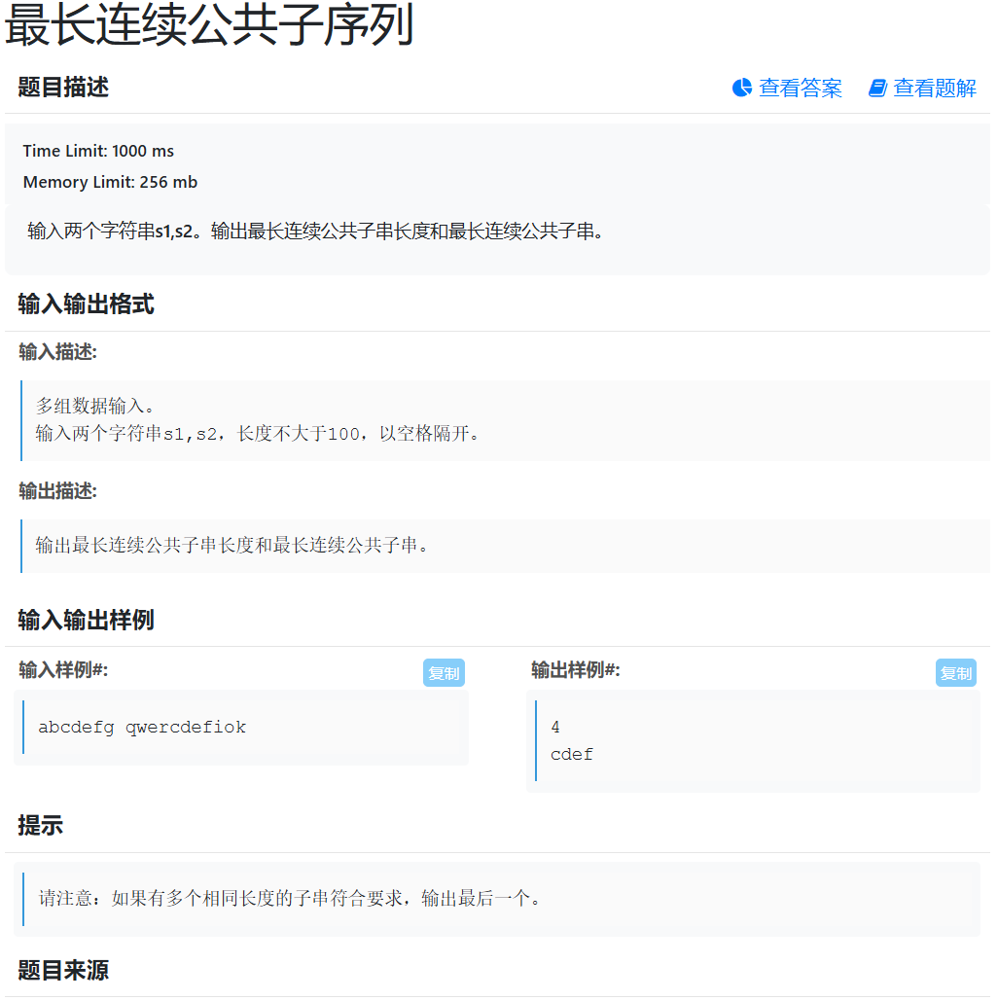
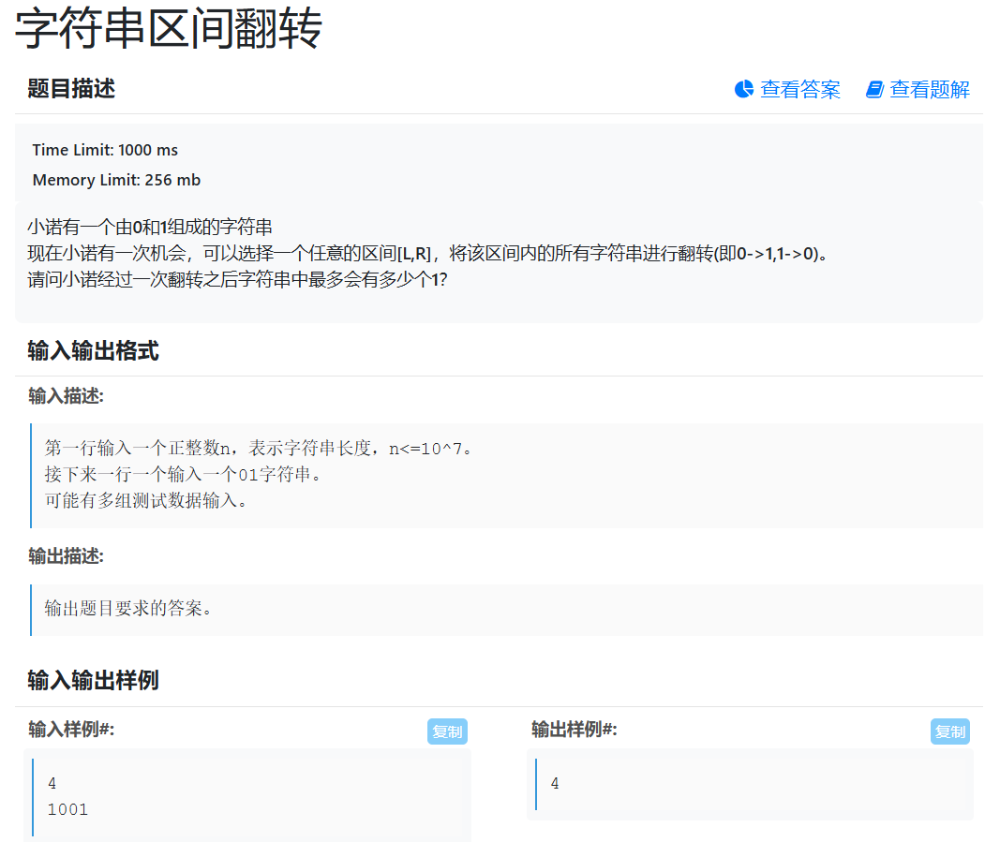

# 最长公共子序列

##### 题目描述

给出两个字符串序列，求最长公共子序列（LCS） 。（改编版，原题规定两字符串长度相等，且无重复元素。）

##### 输入输出格式

###### 输入描述:

多组数据输入。 在一行分别输入两个字符串。(字符串长度<=1000)

###### 输出描述:

输出两个字符串的最长公共子序列的长度。

##### 输入输出样例

```
abcde ace
```

###### 输出样例#:

复制

```
3
```

##### 题目来源

```
上海交通大学/中国矿业大学/南京大学2024年机试题
```


## 算法设计

设 `dp[i][j]` 表示字符串 `s1` 前 `i` 个字符和 `s2` 前 `j` 个字符的最长公共子序列长度：

- 若 `s1[i] == s2[j]`，则 `dp[i][j] = dp[i-1][j-1] + 1`。
- 否则，`dp[i][j] = max(dp[i-1][j], dp[i][j-1])`。

最后输出 `dp[n][m]` 即为答案，时间复杂度为 `O(nm)`，空间复杂度为 `O(nm)`。


## 代码实现

```cpp
#include<iostream>
#include<string>
using namespace std;
string s1, s2;
int dp[1010][1010];
int main()
{
	while(cin >> s1 >> s2){
	int n = s1.size(), m = s2.size();
	s1 = "0" + s1;
	s2 = "0" + s2;
	for (int i = 1; i <= n; i ++)
	{
		for (int j = 1;j <= m;j ++)
		{
			dp[i][j] = max(dp[i-1][j], dp[i][j-1]);
			if (s1[i] == s2[j]) {
				dp[i][j] = dp[i-1][j-1] + 1;
			}			
	}}
		
	
	cout << dp[n][m];}
	
	return 0;
}
```

# 完全背包问题

```cpp
#include<iostream>
#include<cstring>
using namespace std;
const int N = 1e4 + 10;
int w[N], v[N];
int dp[1010];

int main()
{
	int n, m;
	while(cin >> n >> m) {
		memset(dp, 0, sizeof dp);
		for (int i = 1; i <= n; i ++)
		{
			cin >> w[i] >> v[i];
		}
		for (int i = 1; i <= n; i ++) 
		{
			for (int j = w[i]; j <= m; j ++)
			{
				dp[j] = max(dp[j - w[i]] + v[i], dp[j]);	
			}
		}
		cout <<dp[m] << endl;
	}
	return 0;
}
```


# 最长连续公共子序列


## 算法设计
采用**动态规划**求最长连续公共子串。

定义 `f[i][j]` 表示以 `s1[i-1]` 和 `s2[j-1]` 结尾的最长公共子串长度。

- 若 `s1[i-1] == s2[j-1]`，则 `f[i][j] = f[i-1][j-1] + 1`。
- 否则说明连续匹配中断，`f[i][j] = 0`。
- 遍历过程中用 `maxLen` 记录最大长度，用 `end` 记录该子串在 `s1` 中的结束位置。
- 当出现相同最大长度时也更新，因此可以保留最后出现的最长公共子串。

最后通过 `s1.substr(end - maxLen, maxLen)` 得到结果。时间复杂度为 `O(nm)`，空间复杂度为 `O(nm)`
## 代码实现
```cpp
#include <iostream>
#include <string>
using namespace std;

int f[105][105];

int main()
{
    string s1, s2;

    while (cin >> s1 >> s2)
    {
        int n = s1.size();
        int m = s2.size();

        int maxLen = 0;
        int end = 0;

        for (int i = 1; i <= n; i++)
        {
            for (int j = 1; j <= m; j++)
            {
                if (s1[i - 1] == s2[j - 1])
                {
                    f[i][j] = f[i - 1][j - 1] + 1;

                    if (f[i][j] >= maxLen)
                    {
                        maxLen = f[i][j];
                        end = i;
                    }
                }
                else
                {
                    f[i][j] = 0;
                }
            }
        }

        cout << maxLen << endl;
        cout << s1.substr(end - maxLen, maxLen) << endl;
    }

    return 0;
}
```

# 字符串区间翻转


## 算法设计
可以把它理解成：**我们不是直接想“翻哪一段”，而是先算“翻每个字符赚还是亏”。**

比如：

```
1001
```

原来有 2 个 `1`。

如果翻转一个字符：

```
0 -> 1   相当于多了一个1，赚 +1
1 -> 0   相当于少了一个1，亏 -1
```

所以：

```
1 0 0 1
↓ ↓ ↓ ↓
-1 +1 +1 -1
```

现在问题就变成了：

> 在这一串 `+1、-1` 里面，找一段连续区间，让总收益最大。

这里最好的就是中间两个 `0`：

```
+1 +1
```

收益是 `2`。

所以最终：

```
原来有 2 个1
翻转后最多增加 2 个1


答案 = 2 + 2 = 4
```

代码里的：

```
cur = max(0, cur + x);
```

可以理解成：

> 我不断把当前字符的收益加进来，如果发现这一段已经亏了，就不要这一段了，重新开始。

而：

```
maxSum = max(maxSum, cur);
```

就是一直记录：

> 到目前为止，哪一段翻转最划算。

所以整道题一句话总结就是：**把 `0` 看成 `+1`，把 `1` 看成 `-1`，然后找收益最大的连续区间，最后加上原来 `1` 的数量**
## 代码实现
```cpp
#include <iostream>
#include <string>
#include <algorithm>
using namespace std;

int main()
{
    int n;
    string s;

    while (cin >> n >> s)
    {
        int cnt = 0;      // 原来1的数量
        int cur = 0;      // 当前最大收益
        int maxSum = 0;   // 最大收益，至少为0，可以不翻转

        for (int i = 0; i < n; i++)
        {
            int x;

            if (s[i] == '0')
            {
                x = 1;    // 0 -> 1，收益+1
            }
            else
            {
                x = -1;   // 1 -> 0，收益-1
                cnt++;
            }

            cur = max(0, cur + x);
            maxSum = max(maxSum, cur);
        }

        cout << cnt + maxSum << endl;
    }

    return 0;
}
```