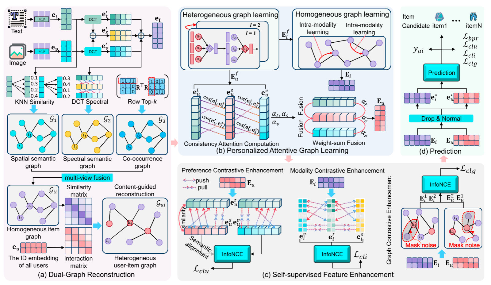

# 方法流

这张图可以概括为两条并行关系：

- **主推荐流**：多模态特征 → 双图重构 → 双图传播 → 个性化融合 → 偏好预测。
- **自监督辅助流**：用户对比学习 + 物品对比学习 + 图扰动对比学习 → 辅助主任务训练。

整体箭头可以记成：
$$
\{V,T,R\}
\rightarrow
\{G_1,G_2,G_3\}
\rightarrow
G_{ii}
\rightarrow
G_{ui}
\rightarrow
\text{双图传播}
\rightarrow
E_u,E_i
\rightarrow
\hat y_{ui}
$$
其中 $V$ 是图像特征，$T$ 是文本特征，$R$ 是用户—物品交互矩阵。

------

## 一、输入与多模态特征处理

模型有三类输入：
$$
\text{图像特征 }V,\qquad
\text{文本特征 }T,\qquad
\text{交互矩阵 }R
$$
图像和文本特征首先经过 MLP，被映射到统一的低维空间：
$$
e_i^v=\operatorname{MLP}(V_i),\qquad
e_i^t=\operatorname{MLP}(T_i)
$$
这里的目的不是直接推荐，而是把原始图像、文本特征变成适合构图和图传播的表示。

与此同时，模型对图像和文本特征进行 DCT：
$$
W_v=\operatorname{DCT}(V),\qquad
W_t=\operatorname{DCT}(T)
$$
并将二者拼接为混合频域表示：
$$
W_s=[W_v\mid W_t]
$$
论文将频域表示用于构建额外的频域语义视图，以补充原始空间相似性。

代码中对应：

```
w_t = dct.dct(self.t_feat, norm='ortho')
w_v = dct.dct(self.v_feat, norm='ortho')
self.interleaved_feat = torch.cat((w_v, w_t), 1)
```

也就是分别对每个物品的文本和图像特征做正交归一化 DCT，再在特征维度上拼接。

------

# 二、模块（a）：Dual-Graph Reconstruction

这一部分先重构物品图，再利用物品图重构用户—物品图，是整个模型最核心的部分。

## 2.1 构建空间语义图 $G_1$

模型在原始图像和文本特征空间中计算物品间的余弦相似度：
$$
s_{ij}
=
\frac{e_i^\top e_j}
{\|e_i\|\|e_j\|}
$$
然后对每个物品保留相似度最高的 Top-$K$ 个邻居，构建 KNN 图。

图像图和文本图进一步加权融合：
$$
G_{\text{spatial}}
=
\alpha_{\text{img}}G_{\text{img}}
+
(1-\alpha_{\text{img}})G_{\text{text}}
$$
通俗地说：

> 从图片和文字内容出发，找出每个商品最相似的若干商品。

它提供的是原始内容语义，但也可能把“外观相似、实际偏好无关”的物品连接起来，所以还需要另外两个视图进行修正。

------

## 2.2 构建频域语义图 $G_2$

模型对 DCT 后的频域特征进行低频、高频划分：
$$
(W_{\text{lf}},W_{\text{hf}})
=
\operatorname{Split}(W,r)
$$
其中前 $rD$ 个系数作为低频，其余作为高频。

然后分别使用低频、高频和图文混合频域特征构建 KNN 图：
$$
G_{\text{lf}},\quad
G_{\text{hf}},\quad
G_{\text{mix}}
$$
最后加权融合：
$$
G_{\text{spec}}
=
\beta_{\text{lf}}G_{\text{lf}}
+
\beta_{\text{hf}}G_{\text{hf}}
+
\beta_{\text{mix}}G_{\text{mix}}
$$
通俗地说：

> 空间图看原始特征像不像，频域图看两个物品的整体变化模式和细节变化模式像不像。

频域图的作用是为物品关系提供另一个观察角度，降低模型对单一空间相似度的依赖。

------

## 2.3 构建共现图 $G_3$

共现图不使用图像和文本，而是使用用户行为：
$$
C=R^\top R
$$
其中 $C_{ij}$ 表示物品 $i$ 和物品 $j$ 被同一用户交互的次数。

例如很多用户同时购买了手机和手机壳，那么手机和手机壳的共现值就较高。

模型对每一行保留 Top-$K$ 共现物品并归一化：
$$
G_{\text{co}}
=
\operatorname{RowSoftmax}
\bigl(\operatorname{TopK}(R^\top R)\bigr)
$$
通俗地说：

> 空间图和频域图看“内容像不像”，共现图看“用户行为上是否经常一起出现”。

------

## 2.4 三视图融合为物品—物品图 $G_{ii}$

首先融合空间图和频域图：                                                                                                                                                                                                                                                    
$$
G_{\text{sem}}^{ii}
=
(1-\lambda_{\text{spec}})G_{\text{spatial}}
+
\lambda_{\text{spec}}G_{\text{spec}}
$$
再融合语义图与共现图：
$$
G_{ii}
=
\alpha_{\text{co}}G_{\text{co}}
+
(1-\alpha_{\text{co}})G_{\text{sem}}^{ii}
$$
所以最终物品图同时包含：

- 原始图文内容相似性。
- DCT 频域相似性。
- 用户行为共现关系。

这一步的目标是对原始物品关系进行重新加权和剪枝，减少模态相似性产生的噪声边。

------

## 2.5 用物品图重构用户—物品图 $G_{ui}$

这是论文标题中“让两个图对话”的关键步骤。

首先对物品图进行阈值剪枝、Top-$K$ 筛选和行归一化，得到物品转移矩阵：
$$
S_{\theta,k}
=
\operatorname{RowNorm}
\left(
\operatorname{TopK}
\{G_{ii}(i,j)\geq\theta\}
\right)
$$
然后让用户的原始交互通过物品关系向外扩展：
$$
\widetilde R=RS_{\theta,k}
$$
例如，用户交互过物品 $i_1$，而 $i_1$ 与 $i_2$ 在物品图中高度相关，那么用户与 $i_2$ 之间就会得到一个潜在弱交互。

再将原始交互与扩展交互融合：
$$
R_{\text{mix}}
=
\gamma_{\text{cui}}R
+
(1-\gamma_{\text{cui}})\widetilde R
$$
代码中直接实现为：

```
R_tilde = R @ S_csr

R_mix = (
    self.cui_gamma * R
    + (1.0 - self.cui_gamma) * R_tilde
)
```

最后使用 $R_{\text{mix}}$ 构建归一化用户—物品二部图 $G_{ui}$。

所以“双图对话”的第一层含义是：
$$
\boxed{\text{物品图 }G_{ii}\text{ 指导用户—物品图 }G_{ui}\text{ 的重构}}
$$

------

# 三、模块（b）：Personalized Attentive Graph Learning

双图构建完成以后，模型分别在两张图上传播信息。

## 3.1 用户—物品异构图传播

在重构后的用户—物品图 $G_{ui}$ 上进行 LightGCN 传播：
$$
E^{(l+1)}
=
\widetilde A E^{(l)}
$$
再聚合各层表示：
$$
E
=
\sum_{l=0}^{L_{ui}}E^{(l)}
$$
用户可以从相邻物品聚合信息，物品也可以从交互用户聚合信息。

这一部分学习的是：
$$
\boxed{\text{用户和物品之间的协同过滤关系}}
$$
代码中由 `_lightgcn_propagate()` 完成：

```
side = torch.sparse.mm(adj, ego)
all_embeddings.append(ego)
H = torch.stack(all_embeddings, dim=0).sum(dim=0)
```


------

## 3.2 物品—物品同构图传播

用户—物品图传播之后，模型继续在重构后的物品图 $G_{ii}$ 上传播：
$$
h^{(l+1)}
=
G_{ii}h^{(l)}
$$
并使用残差形式更新物品表示：
$$
I^*
=
I+\sum_{l=1}^{L_{ii}}h^{(l)}
$$
图中红色弧线表示物品从同模态的相似物品邻居聚合信息。

代码中对应：

```
h = item_rep
for _ in range(self.n_layers):
    h = torch.sparse.mm(self.mm_adj, h)

item_rep = item_rep + h
```

这里的 `self.mm_adj` 就是融合后的物品—物品图。

这一部分学习的是：
$$
\boxed{\text{物品和相似物品之间的语义关系}}
$$

------

## 3.3 用户个性化注意力融合

用户经过异构图传播后，会得到三个视角的表示：
$$
e_u^v,\qquad e_u^t,\qquad e_u^s
$$
分别对应视觉、文本和融合语义视角。

模型先将三个表示投影并归一化，再计算两两余弦相似度：
$$
\cos(e_u^v,e_u^t),\quad
\cos(e_u^v,e_u^s),\quad
\cos(e_u^t,e_u^s)
$$
每个模态的注意力得分，是它与其他模态一致性得分之和。例如视觉模态：
$$
s_v
=
\cos(e_u^v,e_u^t)
+
\cos(e_u^v,e_u^s)
$$
然后经过 Softmax：
$$
[\alpha_v,\alpha_t,\alpha_s]
=
\operatorname{Softmax}
\left(
\frac{[s_v,s_t,s_s]}{\tau}
\right)
$$
最后按照用户自己的注意力权重融合：
$$
E_u
=
[
\alpha_v e_u^v
\|
\alpha_t e_u^t
\|
\alpha_s e_u^s
]
$$
注意图中虽然写着 “Weight-sum Fusion”，但论文公式和代码实际采用的是**加权后拼接**，而不是直接把三个向量相加。注意力还会通过 EMA 平滑，降低训练过程中权重的剧烈波动。

通俗地说：

> 某个用户的三个模态表示中，哪一个和其他模态更加一致，模型就给它更高的权重。

------

# 四、模块（c）：Self-supervised Feature Enhancement

这一部分包含三个对比学习任务。它们不是独立产生推荐结果，而是在训练阶段约束表示空间。

## 4.1 用户偏好对比增强 $L_{clu}$

对于同一个用户，不同模态下的偏好表示应该相互接近：
$$
e_u^v \leftrightarrow e_u^t,\qquad
e_u^t \leftrightarrow e_u^s
$$
同一个用户的跨模态表示是正样本，不同用户的表示是负样本。

作用是：
$$
\boxed{\text{让同一用户在不同模态下表达一致的兴趣}}
$$
同时它还能稳定前面的个性化注意力权重。

------

## 4.2 物品模态对比增强 $L_{cli}$

对于同一个物品，它的图像、文本和融合表示应该靠近：
$$
e_i^v \leftrightarrow e_i^t,\qquad
e_i^t \leftrightarrow e_i^s
$$
不同物品之间则应拉开。

作用是：
$$
\boxed{\text{减小同一物品图像与文本之间的语义差异}}
$$

------

## 4.3 图扰动对比增强 $L_{clg}$

模型通过 mask noise 或 DropEdge 等方式，生成两份扰动视图：
$$
E_u^1,E_u^2,\qquad
E_i^1,E_i^2
$$
然后要求同一个用户或物品在两个扰动视图下保持接近：
$$
E_u^1 \leftrightarrow E_u^2,\qquad
E_i^1 \leftrightarrow E_i^2
$$
作用是：
$$
\boxed{\text{让表示不因少量边或特征被扰动而明显改变}}
$$
也就是增强模型对图噪声的鲁棒性。

------

# 五、模块（d）：Prediction

完成双图传播和个性化融合后，模型得到最终用户和物品表示：
$$
e_u^*,\qquad e_i^*
$$
图中的 Drop & Normal 表示在预测前进行随机失活或扰动，并进行归一化处理。

用户对物品的预测分数通过点积计算：
$$
\hat y_{ui}
=
{e_u^*}^{\top}e_i^*
$$
分数越高，物品在推荐列表中的排名越靠前。

推理阶段会对用户与全部候选物品计算分数：

```
score_matrix = torch.matmul(
    temp_user_tensor,
    item_tensor.t()
)
```

再按照分数排序得到 Top-$K$ 推荐列表。

------

# 六、联合优化目标

主任务使用 BPR 排序损失：
$$
L_{bpr}
=
-\log
\sigma
\left(
\hat y_{ui}-\hat y_{uj}
\right)
$$
目标是让用户交互过的正物品 $i$ 得分高于未交互的负物品 $j$。

最终损失为：
$$
L
=
L_{bpr}
+
\lambda_{clu}L_{clu}
+
\lambda_{cli}L_{cli}
+
\lambda_{clg}L_{clg}
+
L_{reg}
$$
其中 BPR 是主推荐目标，三个对比损失分别约束用户偏好、物品模态和图扰动表示，正则项用于抑制过拟合。

------

## 七、最简方法流

答辩时可以按照下面八步讲：

1. 输入图像特征、文本特征和用户—物品交互矩阵。
2. 在原始特征空间构建空间语义图。
3. 通过 DCT 构建频域语义图。
4. 通过 $R^\top R$ 构建物品共现图。
5. 融合三个视图，得到去噪物品—物品图 $G_{ii}$。
6. 用 $G_{ii}$ 扩展原始交互，重构用户—物品图 $G_{ui}$。
7. 在 $G_{ui}$ 和 $G_{ii}$ 上分别传播，并通过个性化注意力融合用户多模态偏好。
8. 使用用户侧、物品侧和图扰动侧对比学习辅助训练，最终通过用户—物品表示点积生成 Top-$K$ 推荐。

整套方法最核心的逻辑可以记成：
$$
\boxed{
\text{三视图净化物品图}
\rightarrow
\text{物品图补全交互图}
\rightarrow
\text{双图传播学习表示}
\rightarrow
\text{三类对比学习稳定表示}
\rightarrow
\text{点积预测}
}
$$