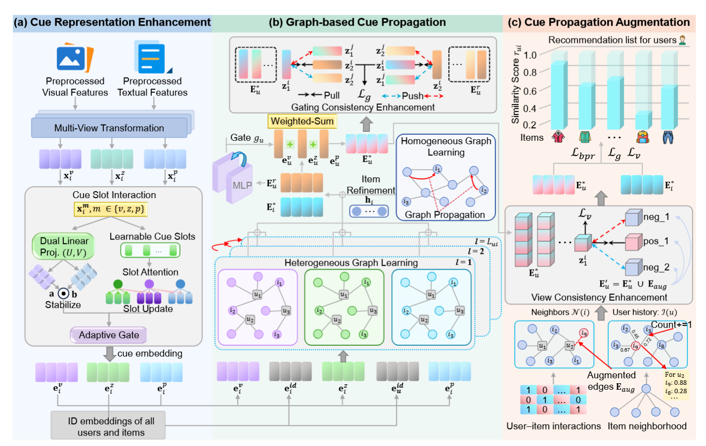

# 方法流



> **先把粗粒度的视觉/文本特征拆成细粒度 cue（线索），再让这些 cue 参与用户偏好传播，并利用 cue 相似性补出原交互图中缺失的潜在用户–物品关系。**

------

## 1. 整体数据流先记成这一条

可以先不看细节，把模型理解成：

$\text{Visual/Text Features} \rightarrow \text{Cue建模} \rightarrow \text{多视图User-Item图传播} \rightarrow \text{用户偏好门控融合} \rightarrow \text{Cue驱动图增强} \rightarrow \text{对比学习约束} \rightarrow \text{BPR推荐}$

更具体一点就是：

$\mathbf{x}_i \rightarrow \mathbf{e}_i^m \rightarrow (\mathbf{e}_u^m,\mathbf{e}_i^m) \rightarrow (\mathbf{e}_u^*,\mathbf{e}_i^*) \rightarrow \mathcal G_{aug} \rightarrow \mathcal L_g+\mathcal L_v+\mathcal L_{bpr}$

这里最重要的三个关键词就是：

**Cue → Propagation → Augmentation。**

------

# 2. (a) Cue Representation Enhancement

## 先把粗粒度模态特征变成“细粒度线索”

左边这一大块解决的是：

> 原来的多模态推荐通常直接把一个图片 embedding 和一个文本 embedding 拼接/加权，但一个 embedding 内部其实还混合了颜色、款式、材质、尺寸等很多不同语义。

所以 CPPRec 不想直接拿整个 embedding 去传播，而是先做 **Cue Representation Enhancement**。

论文明确指出，这部分首先经过 Multi-View Transformation，然后通过 Cue Slot Interaction 得到更细粒度的 cue representation。

------

## 2.1 Multi-View Transformation

最开始输入：

- Preprocessed Visual Features
- Preprocessed Textual Features

然后生成图中的三个 view：

$x_i^v,\quad x_i^z,\quad x_i^p$

这里稍微特殊一点。

论文实际上对文本特征进行了两种变换：

$E_{\text{feat}}^p = ICA(PCA(E_{\text{raw}}^t))$$E_{\text{feat}}^z = ZCA(E_{\text{raw}}^t)$

而视觉特征保持：

$E_{\text{feat}}^v = E_{\text{raw}}^v$

也就是说，可以简单理解成：

```text
视觉特征
   ↓
Visual View v

文本特征
 ├── PCA + ICA → p view
 └── ZCA       → z view
```

目的不是单纯增加模态，而是通过不同的特征空间变换，让原本高度聚集、有冗余的预训练特征重新分布，为后面的 cue 建模提供不同视角。

------

# 3. Cue Slot Interaction：这其实是左侧最核心的模块

对每一个 view：

$x_i^m,\qquad m\in\{v,z,p\}$

都会进入 CSI。

CSI 又分成**两条支路**。

------

## 3.1 第一条：Dual Linear Projection

图里左下角：

> Dual Linear Proj. $(U,V)$

先对同一个特征进行两次不同的线性投影：

$a_i^m=U^m x_i^m$，$b_i^m=V^m x_i^m$

然后做逐元素乘法：

$z_i^m=a_i^m\odot b_i^m$

这个操作非常关键。

它不是简单：

$Wx$

而是在建模：

> **不同隐含 cue 之间的二阶交互。**

比如衣服里面可能有：

- 款式；
- 面料；
- 颜色；
- 领口；
- 尺寸。

经过两个不同投影以后再逐元素乘，相当于让这些不同语义方向发生 interaction。

论文把它称为 **intra-modality cue combinations**。

随后还会：

$e_{b,i}^m= Norm \left( sign(z_i^m)\odot \sqrt{|z_i^m|+\epsilon} \right)$

主要作用是：

**限制极端值 + 稳定 embedding 的数值尺度。**

------

# 4. 第二条：Learnable Cue Slots

图里右边这一支：

```text
Learnable Cue Slots
       ↓
 Slot Attention
       ↓
  Slot Update
```

这个设计更容易从直觉理解。

模型准备 $K$ 个可学习的 slot：

$S^m= [s_1^m,s_2^m,\cdots,s_K^m]$

可以把每一个 slot 想象成一个潜在语义槽位。

例如虽然模型没有人工规定，但它可能逐渐学成：

```text
Slot 1 → style
Slot 2 → color
Slot 3 → fabric
Slot 4 → size
Slot 5 → neckline
...
```

论文并没有规定 slot 必须对应某个具体语义，而是让它自己学。

------

## 4.1 Slot Attention

首先把 item feature 投影成一系列 token：

$T_i^m= [t_{i,1}^m,\cdots,t_{i,K}^m]$

然后：

$Q^m=S^mW_q^m$$K_i^m=T_i^mW_k^m$$V_i^m=T_i^mW_v^m$

计算注意力：

$A_i^m= softmax \left( \frac{Q^m(K_i^m)^T} {\sqrt{d_s}} \right)$

于是：

$R_i^m=A_i^mV_i^m$

本质上就是：

> 每个 Cue Slot 主动去 item feature 中“寻找自己关心的信息”。

例如：

```text
style slot
      ↓ attention
找风格相关信息

fabric slot
      ↓ attention
找材质相关信息
```

论文称 $R_i^m$ 为 **slot-specific cue information**。

------

# 5. Slot Update

找到 cue 信息以后，还要更新 slot：

$\tilde S_i^m = GRU(R_i^m,S^m)$

然后：

$\hat S_i^m = \tilde S_i^m+ MLP(LN(\tilde S_i^m))$

所以这里实际上类似：

```text
初始 Cue Slot
      ↓
从 item feature 中注意到相关信息
      ↓
GRU 更新
      ↓
MLP Refinement
      ↓
针对该 item 的 cue slots
```

最后把所有 slot 拼起来，得到：

$e_{s,i}^m$

也就是 **attentive slot representation**。

------

# 6. Adaptive Gate：把两条 Cue 分支融合

现在我们有两种 cue representation：

### Bilinear branch

$e_{b,i}^m$

负责：

> cue 间显式二阶交互。

### Slot branch

$e_{s,i}^m$

负责：

> 从特征中主动抽取结构化 cue。

然后使用一个维度级门：

$\lambda_i^m = \sigma \left( W_g^m [e_{b,i}^m\Vert e_{s,i}^m] \right)$

融合：

$e_i^m = Norm \left( \lambda_i^m\odot e_{b,i}^m + (1-\lambda_i^m)\odot e_{s,i}^m \right)$

所以左侧整个模块实际上就是：

$x_i^m \rightarrow \begin{cases} \text{Dual Linear Interaction}\\ \text{Cue Slot Attention} \end{cases} \rightarrow Adaptive\ Gate \rightarrow e_i^m$

最终得到图下面：

$e_i^v,\quad e_i^z,\quad e_i^p$

也就是三个 view 的 cue embedding。

------

# 7. (b) Graph-based Cue Propagation

到这里才真正开始“推荐系统”的用户偏好传播。

这部分包含两个图：

```text
User-Item Graph
        ↓
Heterogeneous Graph Learning

Item-Item Graph
        ↓
Homogeneous Graph Learning
```

它们分别解决两个问题。

------

# 8. Heterogeneous Graph Learning

## 在 User-Item 图上学用户偏好

首先下面还有：

> ID embeddings of all users and items

item 的 cue representation 会先和 ID embedding 做一次逐维校准：

$e_i^m = e_{i,id}^m \odot \hat e_{i,feat}^m$

可以理解成：

> 多模态内容负责告诉模型“这个东西是什么”，ID collaborative signal 则告诉模型“推荐系统中的这个 item 应该关注哪些维度”。

论文称其为 **ID-calibrated modality representation**。

------

# 9. 每一个 cue view 单独跑 LightGCN

然后对于：

$m\in\{v,z,p\}$

分别在 user-item graph 上做 LightGCN。

图中三个不同颜色的小图就是：

```text
v-view graph
z-view graph
p-view graph
```

第 $l$ 层：

$e_u^{m,(l+1)} = \sum_{i\in N(u)} \frac{1} {\sqrt{|N(u)||N(i)|}} e_i^{m,(l)}$

item 同理：

$e_i^{m,(l+1)} = \sum_{u\in N(i)} \frac{1} {\sqrt{|N(u)||N(i)|}} e_u^{m,(l)}$

然后把各层结果加起来：

$e_u^m=\sum_{l=0}^{L_{ui}}e_u^{m,(l)}$$e_i^m=\sum_{l=0}^{L_{ui}}e_i^{m,(l)}$

所以此时已经完成：

$\text{Item Cue} \rightarrow \text{User Preference}$

例如：

> 用户买过大量“修身风格”的衣服，那么 style cue 就可以通过 user-item graph 传播到这个用户上。


------

# 10. Homogeneous Graph Learning

## 再通过 Item-Item 图修正 Item

图中右边蓝框：

> Homogeneous Graph Learning

这里不是用户–物品图，而是：

$\mathcal G_{ii}$

即 item-item semantic graph。

把前面得到的 item embedding 当作：

$H^{(0)}$

然后：

$H^{(l+1)} = \tilde A_{mm}H^{(l)}$

最后残差融合：

$E_i^* = E_i+ H^{(L_{ii})}$

即：

```text
User-Item 图
    ↓
item collaborative representation
    ↓
Item-Item semantic graph
    ↓
补充相似 item 信息
    ↓
最终 Item embedding E_i*
```

它的作用就是：

> 用户交互图告诉 item “谁喜欢我”，item semantic graph 再告诉 item “谁和我语义相似”。


------

# 11. Cue Gate：筛用户真正关心的偏好

经过不同 view 的 LightGCN 后，用户现在有：

$e_u^v,\quad e_u^z,\quad e_u^p$

但并不是所有传播来的信息都有用。

于是图中央：

> Gate $g_u$

对每个模态做：

$g_u^m= \sigma(MLP^m(e_u^m))$

然后：

$\hat e_u^m = g_u^m\odot e_u^m$

这是一个 **dimension-wise gate**。

例如某个用户：

```text
style       0.95
color       0.80
fabric      0.20
brand       0.72
size        0.10
```

就相当于模型判断：

> 这个用户的购买决策主要受 style / color 影响，fabric / size 信息比较弱。

所以它是在做：

$\text{传播来的所有偏好} \rightarrow \text{保留真正有用的偏好}$


------

# 12. Weighted Sum：不同用户的模态偏好也不同

接下来再学习一个：

$\alpha_u = softmax(w_u)$

表示用户对不同 view / modality 的偏好程度。

最后：

$e_u^* = Concat \left( \{\alpha_u^m\hat e_u^m\}_{m\in M} \right)$

所以其实存在两级筛选：

### 第一级：dimension-wise gate

$g_u^m$

控制：

> 一个 modality 内哪些维度重要。

### 第二级：modality weight

$\alpha_u^m$

控制：

> 不同 modality 对这个用户的重要程度。

论文明确指出，这种聚合方式使最终的用户表示更接近用户真实的 decision signals。

------

# 13. GateCL：防止 Gate “删过头”

但 gate 有一个问题。

假设：

$g=[0.9,0.8,0.01,0.02,\cdots]$

万一第三维其实很重要，但模型错误地把它压成了 0.01，就会丢失信息。

所以引入：

$\mathcal L_g$

也就是图顶部的：

> Gating Consistency Enhancement

它把：

$\hat e_u^m$

即 gated representation 当 anchor，

同一用户 gate 之前的：

$e_u^m$

作为 positive。

其他用户：

$e_{u'}^m$

作为 negative。

也就是：

```text
               Pull
e_u^m  ←────────────  ê_u^m

e_u'^m ───────────→  ê_u^m
               Push
```

目的不是禁止 Gate 改 representation，而是要求：

> 你可以筛，但不能把这个用户本身的语义结构彻底破坏。

论文将其称为 GateCL，用来稳定 gating optimization，避免 informative preference dimensions 被错误抑制。

------

# 14. (c) Cue Propagation Augmentation

## 这是整个方法第二个很关键的创新点

前面的传播仍然有一个问题：

> LightGCN 只能沿原始 User-Item interaction graph 传播。

假设：

```text
u
↓
i1

i1 和 i9 在“款式、材质”等 cue 上特别相似
```

但是：

$(u,i_9)\notin E$

那么在固定图上，$i_9$ 对用户 $u$ 来说可能根本不可达。

所以 CPPRec 会主动建立新的边。


------

# 15. Cue-driven Edge Augmentation

对于用户 $u$，先拿他的历史 item：

$I(u)$

例如：

$I(u)=\{i_1,i_2,i_3\}$

然后分别找这些 item 的 **cue-aware neighbors**：

$N_{cue}(i)$

例如：

```text
i1 → {i7, i8, i9}
i2 → {i5, i9}
i3 → {i6, i9}
```

那么 $i_9$ 出现了 3 次。

CPPRec 定义：

$s(u,j) = \sum_{i\in I(u)} \mathbb I [j\in N_{cue}(i)]$

于是：

$s(u,i_9)=3$$s(u,i_8)=1$

因此 $i_9$ 更可能是用户潜在感兴趣的 item。

------

# 16. Top-K 候选变成新的 User-Item Edge

选出：

$E_{aug}(u) = TopK_{j\notin I(u)} s(u,j)$

再：

$E_{aug} = \bigcup_u E_{aug}(u)$

最后：

$G_{aug} = (U\cup I,E\cup E_{aug})$

相当于把原来的三跳关系：

$user \rightarrow historical\ item \rightarrow cue\ neighbor$

直接折叠成：

$user \rightarrow candidate\ item$

这就是论文所谓：

> **让原本不可达的 higher-order preference 变得 reachable。**


------

# 17. ViewCL：防止增强边引入噪声

但人工加边肯定有风险。

比如：

```text
用户喜欢红色运动鞋
```

模型看到另一个：

```text
红色高跟鞋
```

cue 上可能比较相似，但用户实际上并不喜欢。

所以增强图：

$G_{aug}$

一定会有少量 noisy edges。

于是模型同时跑：

### 原始图

$e_u^{base}=f(G,u)$

### 增强图

$e_u^{aug}=f(G_{aug},u)$

然后让同一用户的：

$(e_u^{base},e_u^{aug})$

成为 positive pair。

其他用户：

$(e_u^{base},e_{u'}^{aug})$

成为 negative pair。

这就是：

$\mathcal L_v$

ViewCL。

它想实现的平衡是：

```text
增强图
 ↓
探索更多潜在兴趣

但

增强图表示
不能偏离
原始真实交互语义太远
```

论文明确指出，ViewCL 的目标就是一方面利用新增边发现 higher-order interests，另一方面保持与原始 interaction semantics 的一致性。

------

# 18. 最后如何推荐

最终得到：

$e_u^*$

和：

$e_i^*$

预测分数就是最经典的内积：

$\hat r_{ui} = e_u^{*\top}e_i^*$

分数越大：

> 用户 $u$ 越可能喜欢 item $i$。

然后排序得到 Top-K recommendation list。

------

# 19. 最终 Loss

模型最终一起优化四部分：

$\boxed{ \mathcal L = \mathcal L_{bpr} + \lambda_g\mathcal L_g + \lambda_v\mathcal L_v + \lambda_{reg}\|\Theta\|_2^2 }$

其中：

### ① BPR

$\mathcal L_{bpr}$

负责：

> 正样本排名高于负样本。

### ② GateCL

$\mathcal L_g$

负责：

> Gate 前后用户偏好不能发生错误的信息损失。

### ③ ViewCL

$\mathcal L_v$

负责：

> 增强图不能因为加了 noisy edge 而偏离真实交互语义。

### ④ L2 regularization

$\lambda_{reg}\|\Theta\|_2^2$

负责常规正则化。

------

# 20. 把整张图串起来

最后按照真正的数据流，可以把 CPPRec 记成：

```text
               Visual / Text Features
                         │
                         ▼
              Multi-View Transformation
                         │
                  v / z / p views
                         │
                         ▼
                Cue Slot Interaction
                 ┌───────┴───────┐
                 │               │
          Dual Linear       Learnable Slots
          Interaction       + Slot Attention
                 │               │
                 └───────┬───────┘
                         ▼
                   Adaptive Gate
                         │
                         ▼
                Fine-grained Cues
                  e_i^v,e_i^z,e_i^p
                         │
                         ▼
              ID-calibrated Features
                         │
                         ▼
                  User-Item LightGCN
                         │
              ┌──────────┴─────────┐
              │                    │
              ▼                    ▼
       User Preference        Item Embedding
       e_u^v,e_u^z,e_u^p           │
              │                    ▼
              │              Item-Item Graph
              │                    │
              ▼                    ▼
        Dimension Gate            E_i*
              │
              ▼
        Modality Weight
              │
              ▼
             E_u*
              │
             GateCL
              │
              │
       ┌──────┴─────────────────┐
       │                        │
       ▼                        ▼
Historical Items        Cue-aware Neighbors
       │                        │
       └──────────┬─────────────┘
                  ▼
          Candidate Counting
                  │
                  ▼
            Top-K New Edges
                  │
                  ▼
              G_aug
                  │
        Base Graph ↔ Aug Graph
                  │
                ViewCL
                  │
                  ▼
            User / Item Embedding
                  │
                  ▼
             Inner Product
                  │
                  ▼
           Top-K Recommendation
```

对应论文 Algorithm 1，其训练顺序同样是：先做 Multi-View Transformation 和图构建，再执行 cue interaction、LightGCN、item refinement、user gating，随后计算增强图表示，最终联合优化 $\mathcal L_{bpr}$、$\mathcal L_g$ 和 $\mathcal L_v$。

所以这篇方法最本质的逻辑不是简单的“多模态特征 + GCN + 对比学习”，而是形成了一条非常明确的因果式方法链：**先利用 CSI 从粗粒度模态特征中提取更可靠的 fine-grained cues，再让 cue 驱动用户偏好在图上进行选择性传播，最后利用这些 cue 去发现原始交互图中不可达的潜在兴趣关系，并通过 GateCL 和 ViewCL 分别约束“筛选偏好”和“扩充图结构”两个可能引入噪声的步骤。**