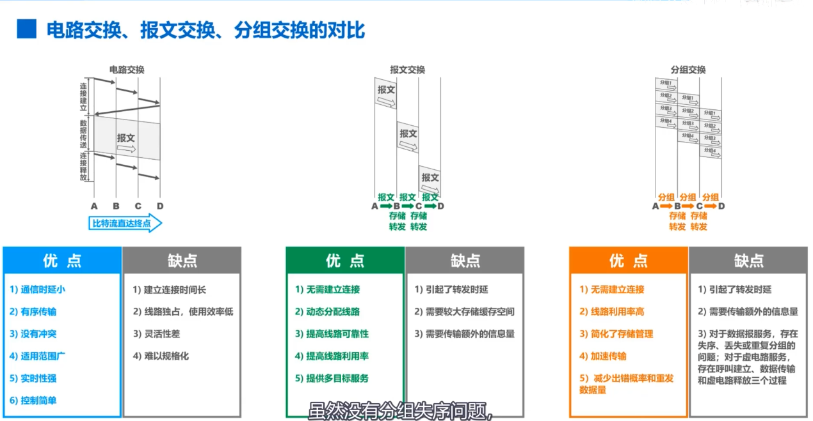

# 三种交换方式

**电路交换（Circuit Switching）**：通信前先建立一条专用通信线路，通信过程中双方始终独占该线路，结束后释放资源。

**报文交换（Message Switching）**：将完整报文作为整体存储转发，交换节点收到全部报文后再转发到下一节点，不需要预先建立连接。

> 把要发送的整块数据称为一个报文

**分组交换（Packet Switching）**：将报文拆分成多个较小的数据包（分组）独立传输，到达目的地后再重新组装，是互联网采用的主要交换方式。

## 电路交换的三个步骤
- 建立连接（分配通信资源）
- 通话（一直占用通信资源）
- 释放连接（归还通信资源）

## 三种交换方式的优缺点

