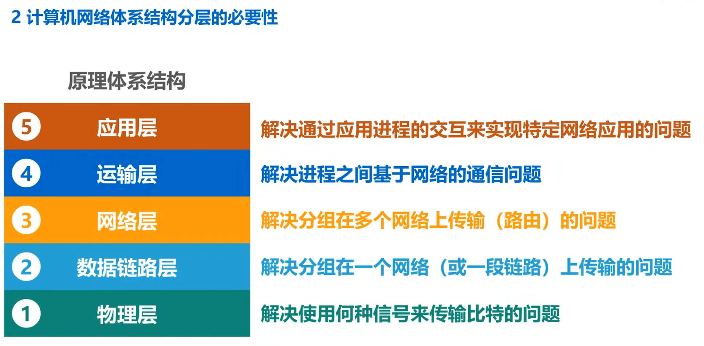
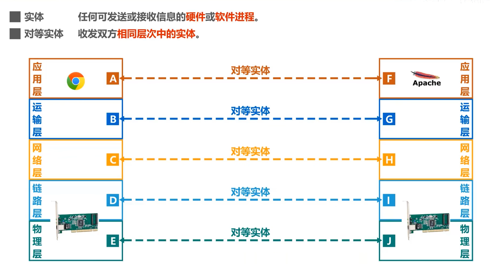
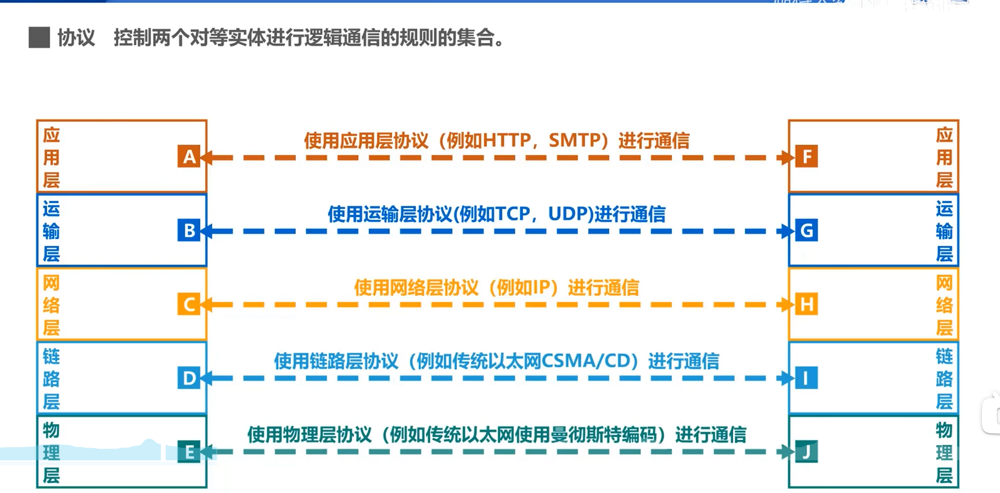
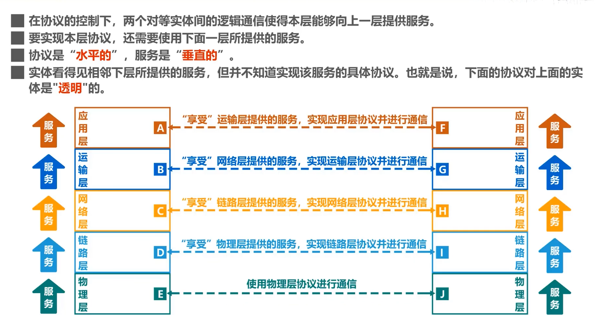

# 计算机网络体系结构

## 应用层
任务是通过应用进程间的交互来完成特定网络应用。

应用层协议定义的是应用进程间通信和交互的规则。

- DNS：域名系统
- HTTP：支持万维网应用
- SMTP：支持电子邮件

应用层交互的数据单元成为**报文**

## 运输层

负责向两台主机中进程之间的通信提供通用的数据传输服务。

- 传输控制协议TCP，其数据传输的基本单元是报文段
- 用户数据报协议UDP，其数据传输的单元是用户数据报

## 网络层

网络层负责为分组交换网上的不同主机提供通信服务。

在发送数据时，网络层把运输层产生的报文段获用户数据报装成分组或包进行传送。

分组也叫IP数据报，或简称数据报。

## 数据链路层

任务是将网路层交下来的IP数据报组装成帧。

## 物理层

在物理层上所传数据的单位是比特。

## 链路交换机实现了哪几层？路由器实现了哪几层？主机实现了哪几层？

- **链路层交换机**：实现 **物理层、数据链路层**。
- **路由器**：实现 **物理层、数据链路层、网络层**。
- **主机**：实现 **全部五层**。

## 常见术语

### 实体
表示任何可以发送或接受的硬件或软件进程。

### 协议

### 服务

