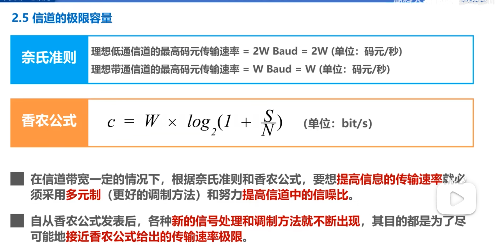

# 物理层的基本概念
物理层考虑的是怎样才能在连接各种计算机的传输媒体上传输数据比特流。

物理层为数据链路层屏蔽了各种传输媒体的差异，使数据链路层只需要考虑如何完成本层的协议
和服务，而不必考虑网络具体的传输媒体是什么。

## 四个特性
- 机械特性：指明接口所用接线器的形状和尺寸引脚数目和排列、固定和锁定装置。
- 电气特性：在接口电缆的各条线上出现的电压的范围。
- 功能特性：指明某条线上出现的某一电平的电压意义。
- 过程特性：指明对于不同功能的各种可能事件的出现顺序。

## 单工、半双工、全双工
- 单工通信（单向通信）：只能有一个方向的通信而没有反方向的交互。
- 半双工（双向交替通信）：通信的双方都可以发送信息，但不能双方同时发送。
- 全双工（双向同时通信）：通信的双方可以同时发送和接收信息。

## 奈氏准则和香农公式

> W:带宽
S:信号的平均功率
N:噪声的平均功率