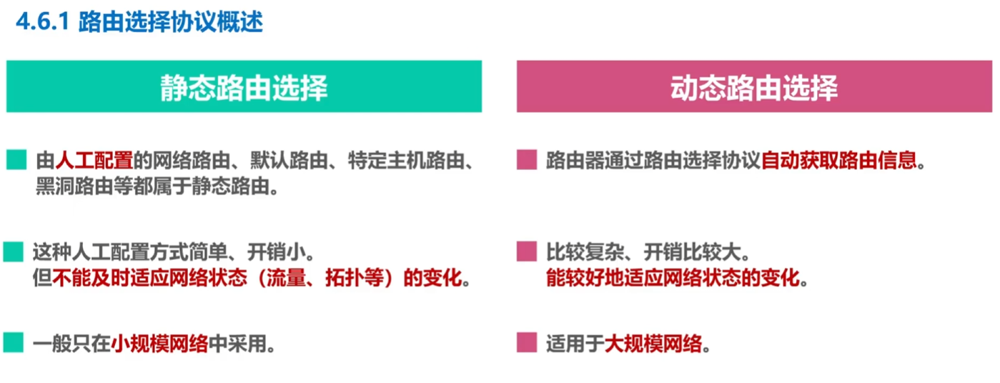
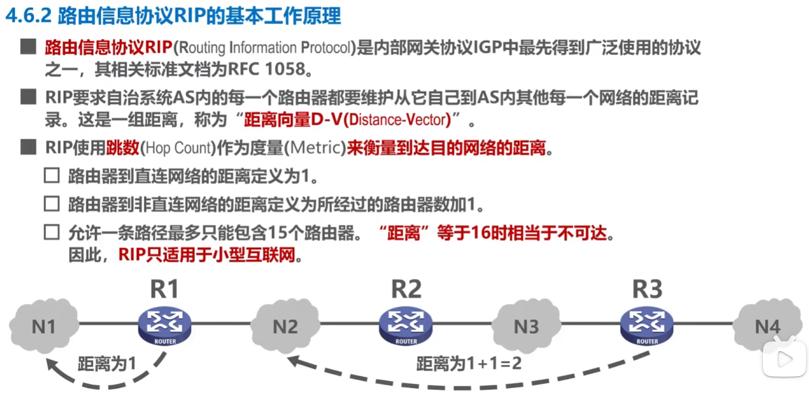
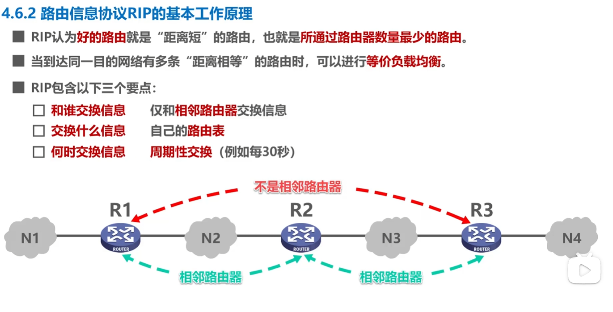
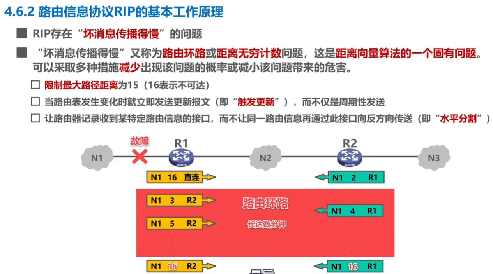
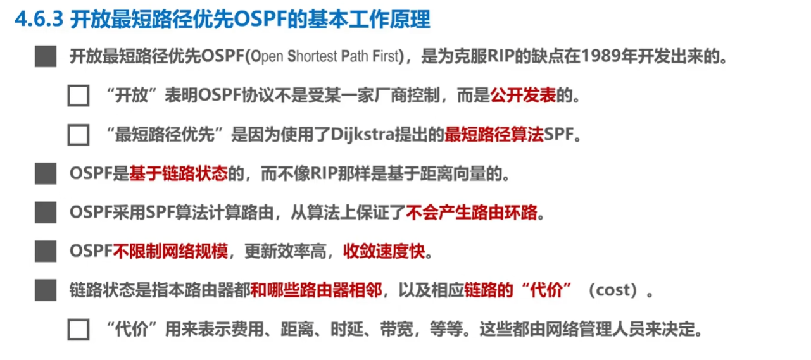

# 网络层

## 网络层概述

## 网络层提供的两种服务

## IP地址
IPv4 地址就是用于在网络中唯一标识一
个主机或网络接口的 32 位地址，属于计算机网络中网络层的知识点。

### 分类编址的IPv4地址

> 记忆一下全0和全1

对于A类地址来说

### 划分子网的IPv4地址

### 无分类编址的IPv4地址

### IPv4地址的应用规划

## IP数据报的发送和转发过程

## 路由选择协议概述

### 路由信息协议RIP

> RIP 的“坏消息传得慢”是指网络发生故障后，相邻路由器可能利用彼此的过时路由信息产生路由环路，使距离逐步增加到无穷大（RIP 中为 16）后，才最终确认网络不可达。

### 开放最短路径优先OSPF

