# 网络层

## 网络层概述

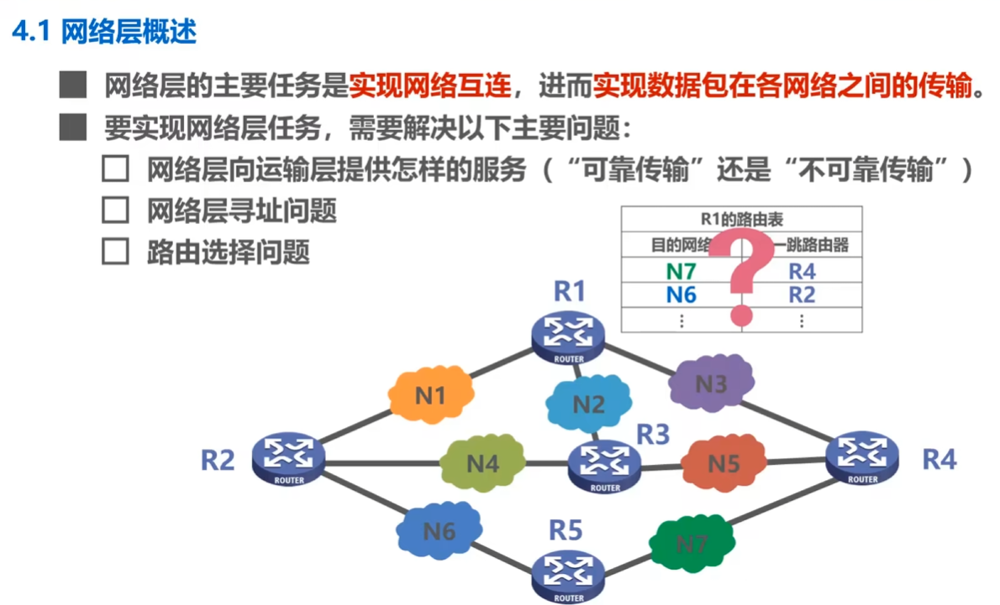

## 网络层提供的两种服务
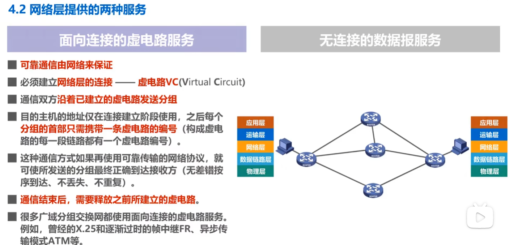
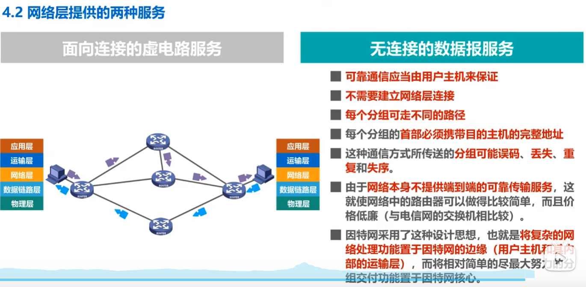
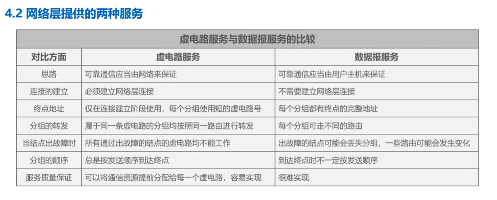

## IP地址
IPv4 地址就是用于在网络中唯一标识一
个主机或网络接口的 32 位地址，属于计算机网络中网络层的知识点。
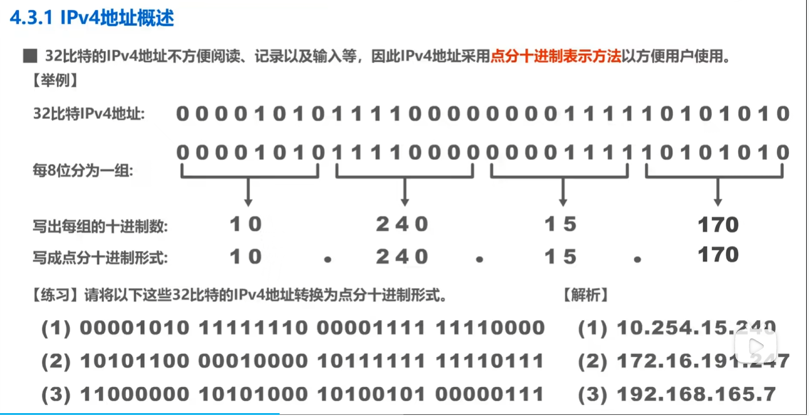

### 分类编址的IPv4地址
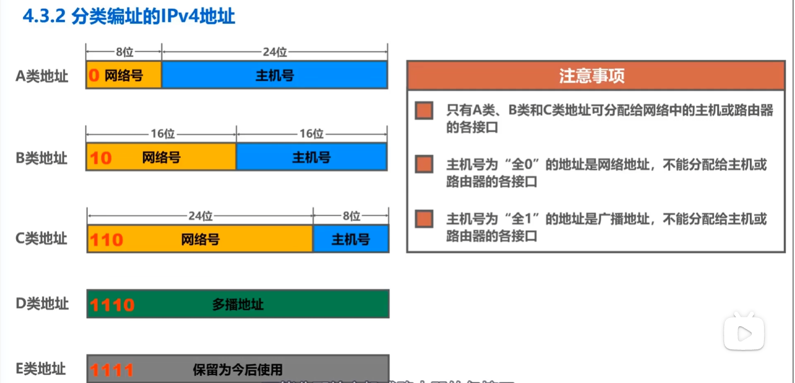
> 记忆一下全0和全1

对于A类地址来说
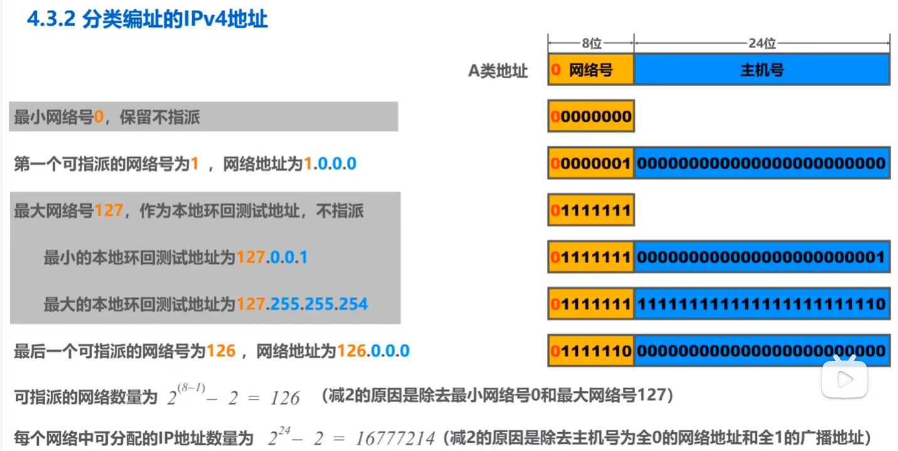
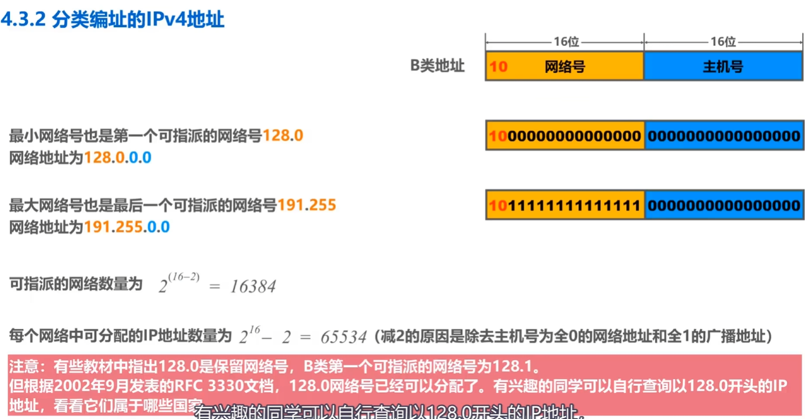
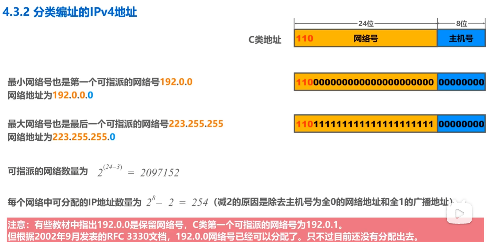
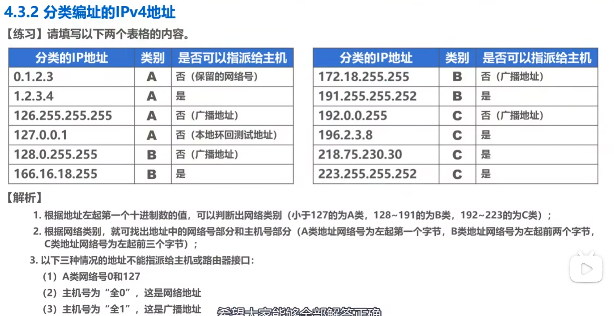

### 划分子网的IPv4地址
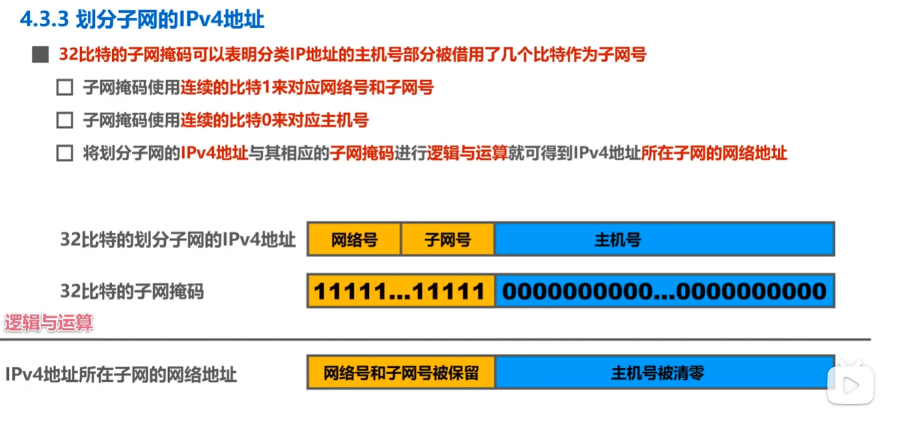
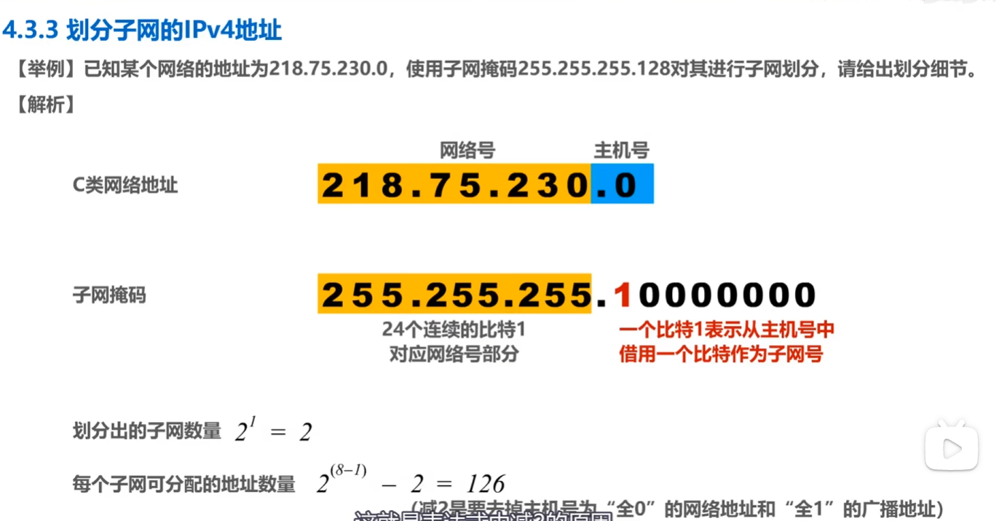
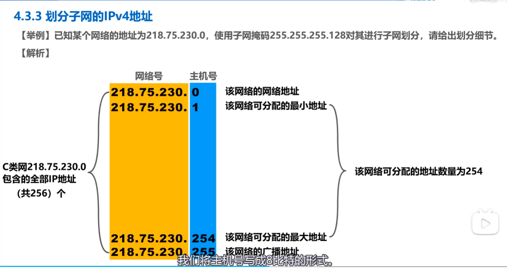
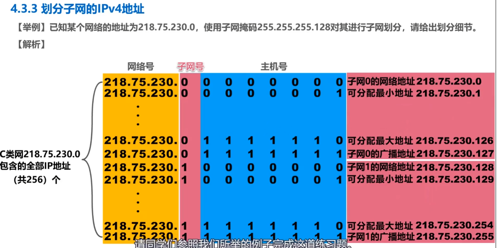

### 无分类编址的IPv4地址

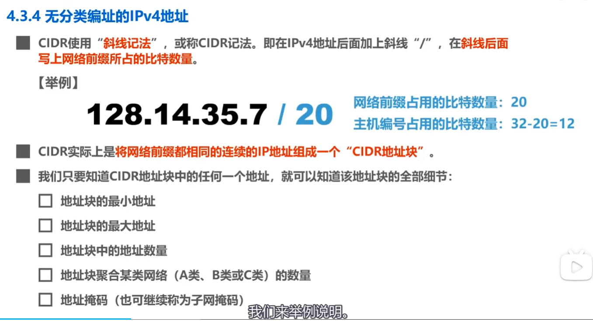
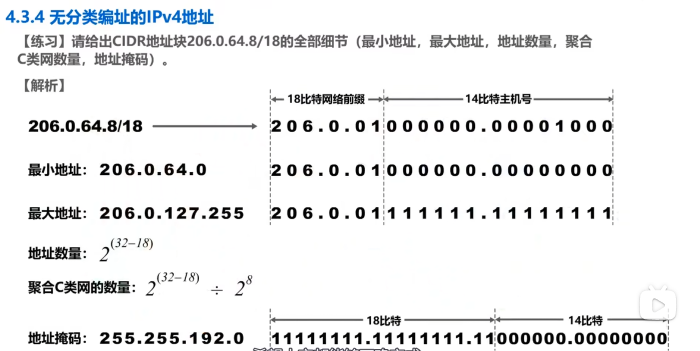

### IPv4地址的应用规划
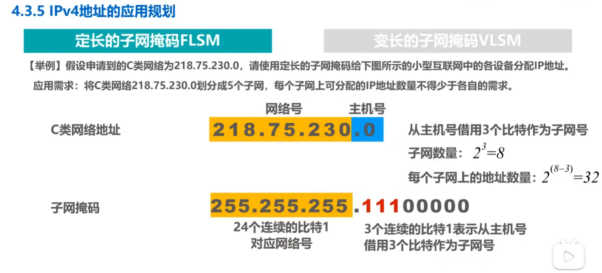
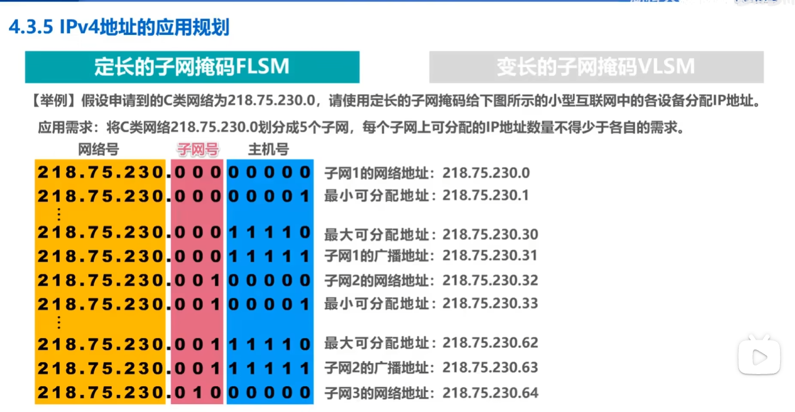

## IP数据报的发送和转发过程
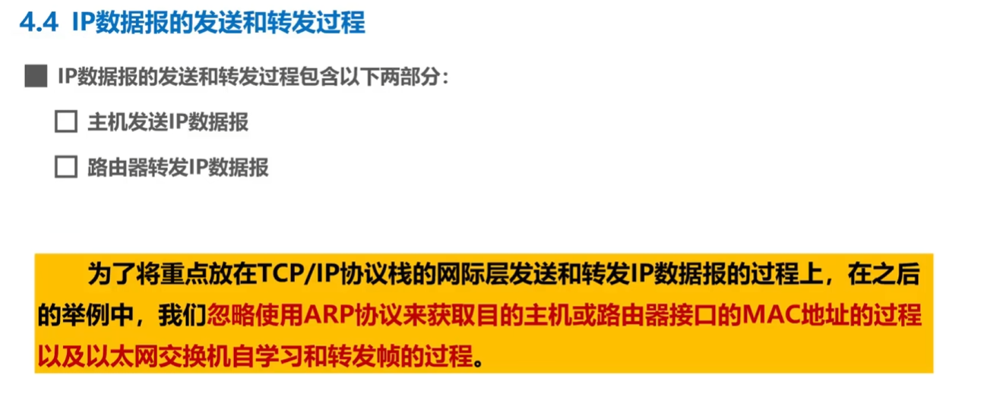
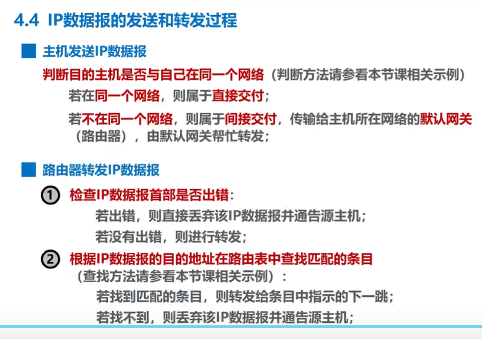