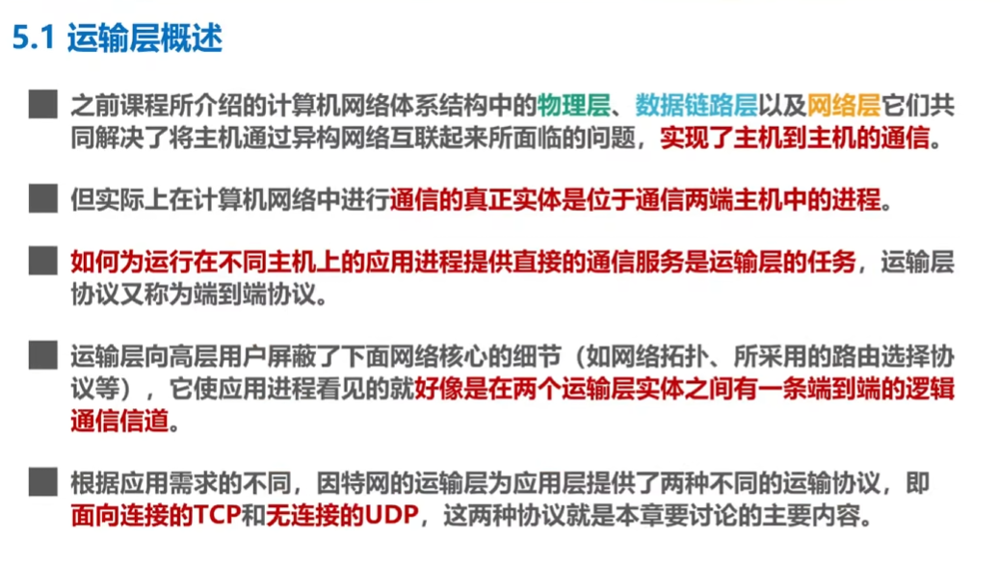
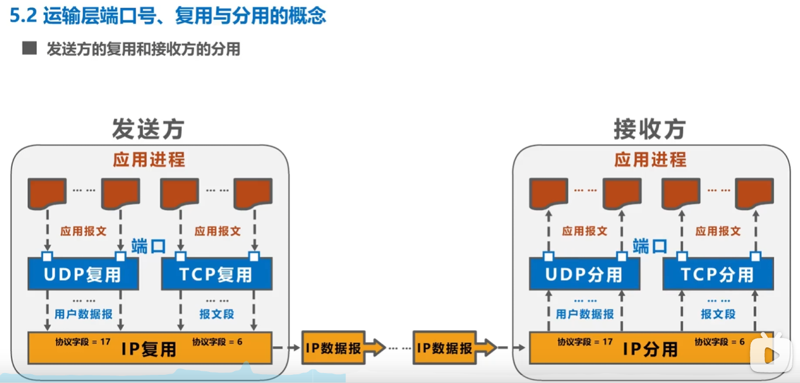
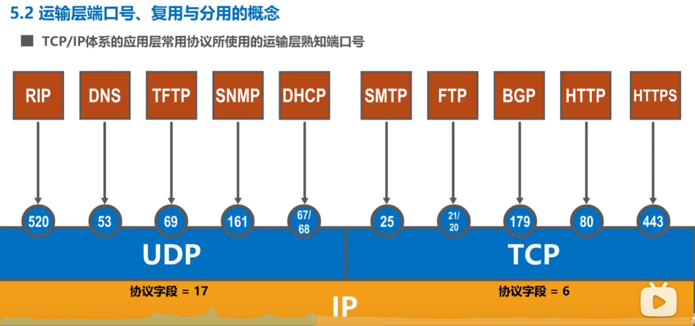
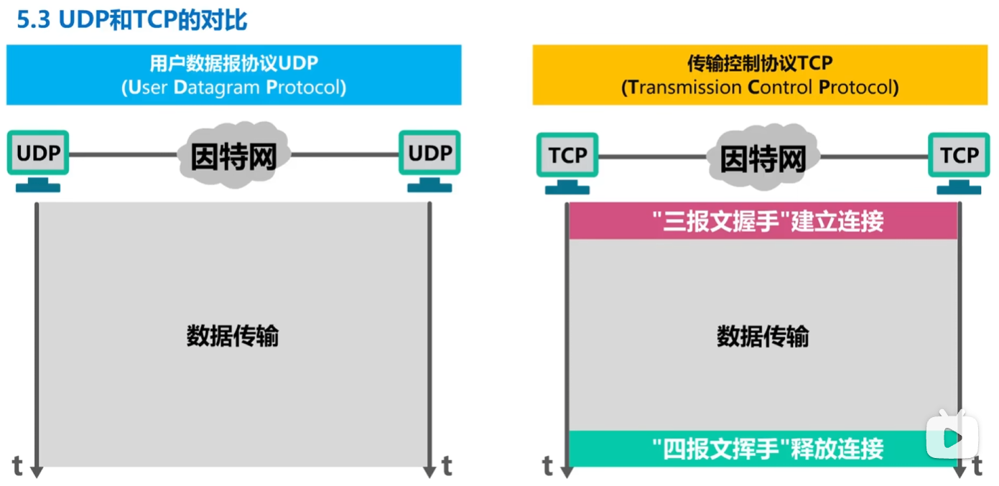
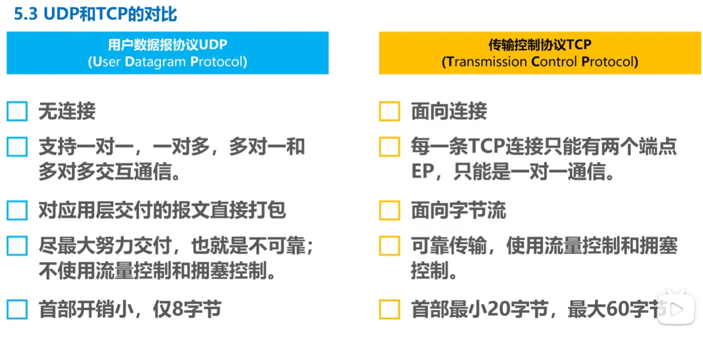
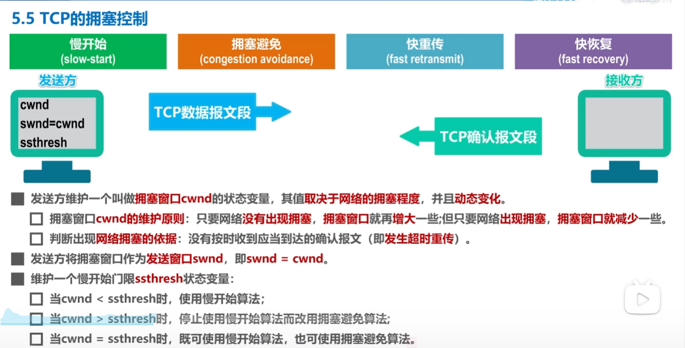
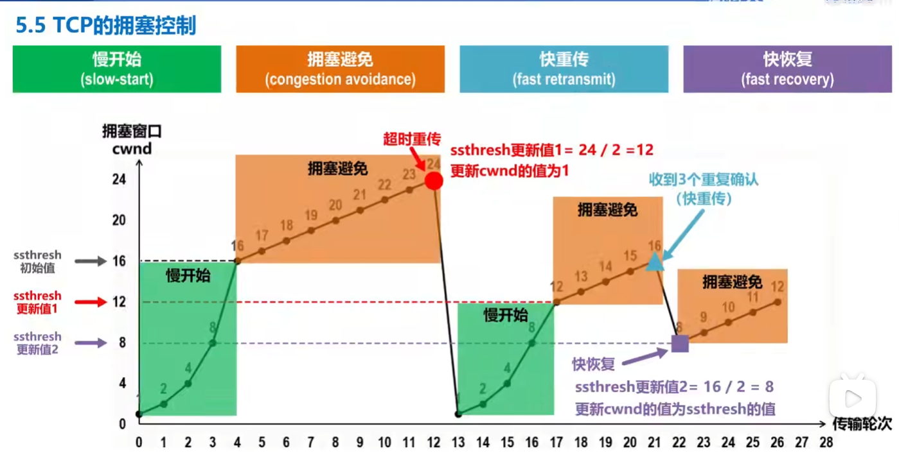
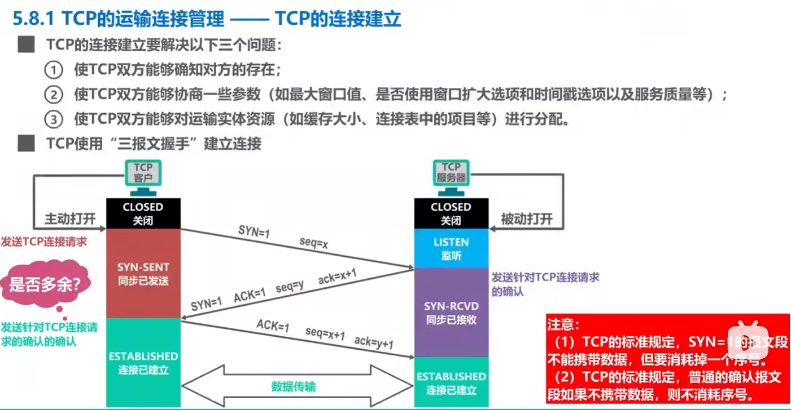
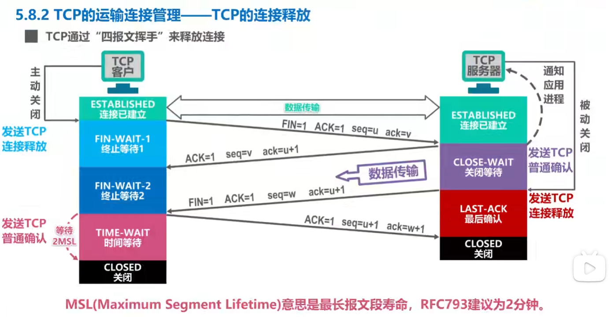

# 运输层

## 运输层熟知端口号

## UDP和TCP的对比

## TCP的拥塞控制

慢开始：发送窗口从较小值开始，并按指数速度增大，用来快速试探网络承载能力。

拥塞避免：当窗口达到门限后改为线性增长，防止发送速度增长过快导致拥塞。

快重传：连续收到 3 个重复 ACK 时，不等超时就立即重传可能丢失的报文段。

快恢复：发生快重传后适当减小拥塞窗口，但不降到 1，而是继续较快恢复传输。

## TCP的连接建立

## TCP的连接释放
