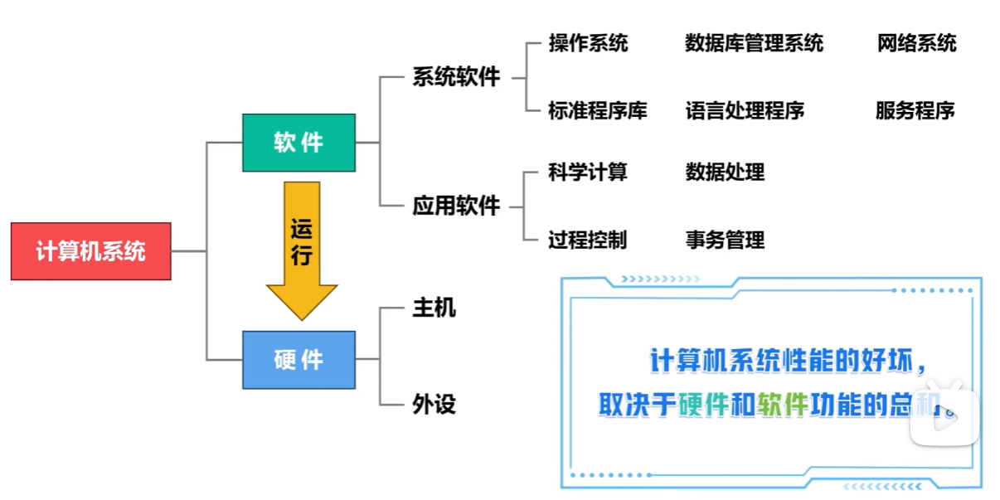
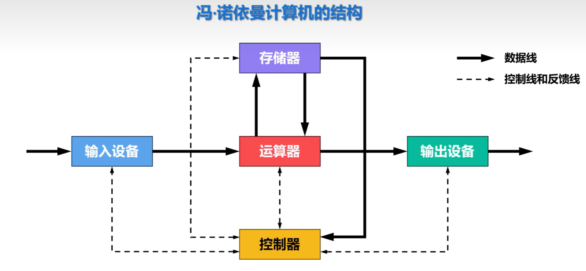
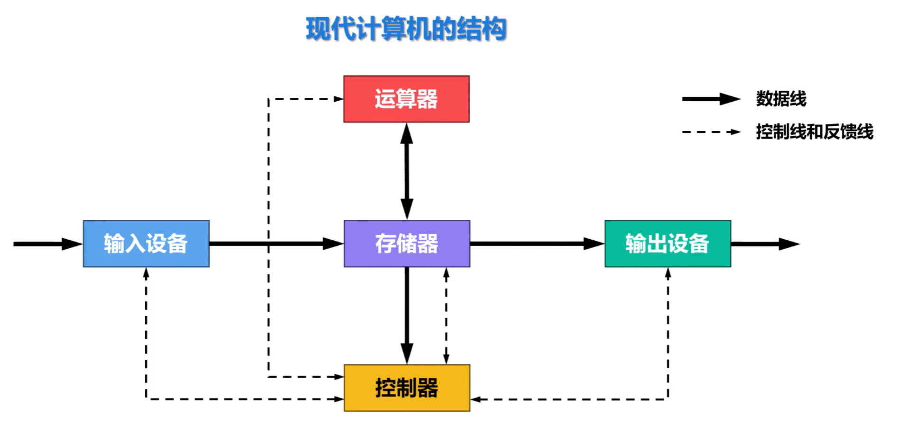

# 计算机系统的组成

## 冯·诺依曼计算机的结构

注意：此时是以运算器为中心

## 现代计算机的结构

现代计算机以存储器为中心

| 部分               | 作用                                                         |
| ------------------ | ------------------------------------------------------------ |
| **输入设备**       | 负责把外部的数据、程序或操作命令输入到计算机中。             |
| **存储器**         | 负责存放程序、原始数据、中间结果和最终结果，是现代计算机结构的中心。 |
| **运算器**         | 负责进行算术运算和逻辑运算，例如加减乘除、比较大小等。       |
| **控制器**         | 负责从存储器中取出指令、分析指令，并指挥各部件协调工作。     |
| **输出设备**       | 负责把计算机处理后的结果输出给用户或其他设备。               |

## 计算机系统的性能指标

1. 响应时间 / 执行时间

这是最直观的指标，表示**完成一个任务需要多久**。

比如运行一个程序花了 2 秒，另一个电脑花了 1 秒，那么后者响应时间更短，性能更好。

常用公式：
$$
性能 = \frac{1}{执行时间}
$$
也就是说，执行时间越短，性能越高。

------

2. 吞吐率

吞吐率表示**单位时间内能完成多少任务**。

例如服务器每秒能处理 1000 个请求，就比每秒处理 500 个请求的吞吐率高。

响应时间关注“一个任务多久完成”，吞吐率关注“同时能处理多少任务”。

------

3. CPU 主频

主频表示 CPU 时钟频率，也就是每秒有多少个时钟周期。

例如：
$$
3GHz = 每秒 30 亿个时钟周期
$$
主频越高，理论上 CPU 节奏越快，但**不能只看主频判断性能**，因为不同 CPU 每个周期能完成的工作量不同。

------

4. 时钟周期

时钟周期是主频的倒数，表示一个时钟周期持续多长时间。
$$
时钟周期 = \frac{1}{主频}
$$
例如主频越高，时钟周期越短，CPU 的基本节拍越快。

------

5. CPI

CPI 全称是 **Cycles Per Instruction**，意思是**平均每条指令需要多少个时钟周期**。

比如 CPI = 2，表示平均执行一条指令需要 2 个时钟周期。

CPI 越小，说明 CPU 执行指令越高效。

------

6. 指令条数 IC

IC 是 **Instruction Count**，表示程序执行过程中总共执行了多少条机器指令。

同一个程序，在不同编译器、不同指令集、不同优化方式下，指令条数可能不同。

------

7. CPU 执行时间公式

计算机组成原理里最重要的性能公式是：
$$
CPU时间 = 指令条数 \times CPI \times 时钟周期
$$
也可以写成：
$$
CPU时间 = \frac{指令条数 \times CPI}{主频}
$$
所以 CPU 性能主要受三个因素影响：
$$
指令条数、CPI、主频
$$
想让程序跑得快，就要减少指令条数、降低 CPI、提高主频。

------

8. MIPS

MIPS 表示 **每秒执行多少百万条指令**。
$$
MIPS = \frac{指令条数}{执行时间 \times 10^6}
$$
它可以粗略衡量 CPU 执行整数指令的速度。

但是 MIPS 不一定可靠，因为不同机器的“指令”复杂程度不同，不能简单比较。

------

9. FLOPS

FLOPS 表示 **每秒执行多少次浮点运算**，常用于衡量科学计算、深度学习、图形计算性能。

常见单位有：
$$
MFLOPS、GFLOPS、TFLOPS
$$
其中：
$$
1TFLOPS = 每秒 10^{12} 次浮点运算
$$
GPU、AI 加速卡经常用 FLOPS 衡量计算能力。

------

10. 带宽

带宽表示**单位时间内可以传输多少数据**。

例如内存带宽、总线带宽、磁盘带宽、网络带宽。

带宽越大，数据搬运能力越强。

如果 CPU 很快但内存带宽不足，就会出现“CPU 等数据”的情况。

------

11. 存储器访问时间

存储器访问时间表示 CPU 访问内存、缓存或磁盘需要多久。

一般速度关系是：
$$
寄存器 > Cache > 内存 > SSD > 硬盘
$$
访问时间越短，系统整体性能越好。

12. 命中率

命中率常用于 Cache，表示 CPU 要访问的数据能不能在缓存中找到。
$$
命中率 = \frac{命中次数}{访问总次数}
$$
Cache 命中率越高，CPU 越少访问慢速内存，程序执行越快。