# 高速缓冲存储器cache

如果数据不在cache中，则称为数据缺失，此时需要将缺失数据从主存调入cache中。

数据缺失时的访问时间称为缺失补偿。

## 程序局部性

## cache系统的性能评价

## cache读操作的基本流程

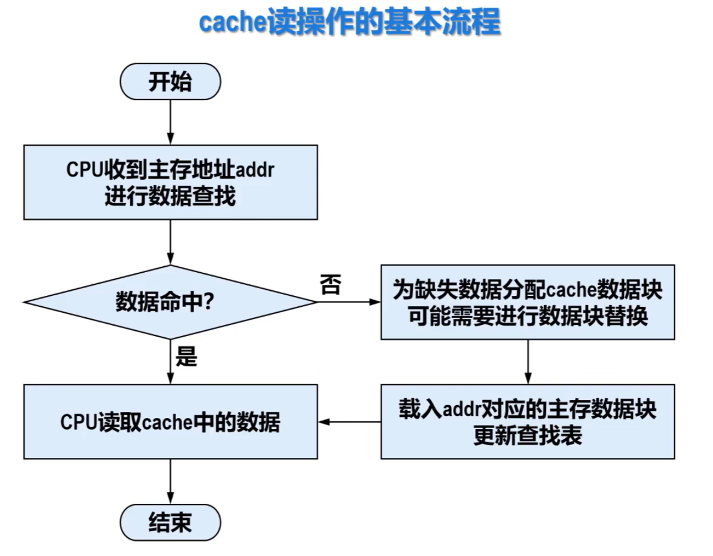

读操作涉及到的关键技术

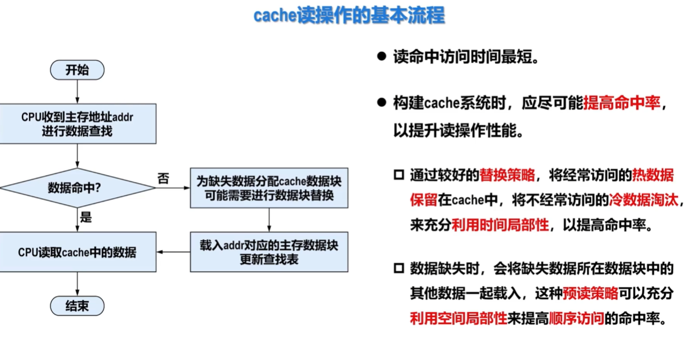
> 替换策略，预读策略

## cache写操作的基本流程
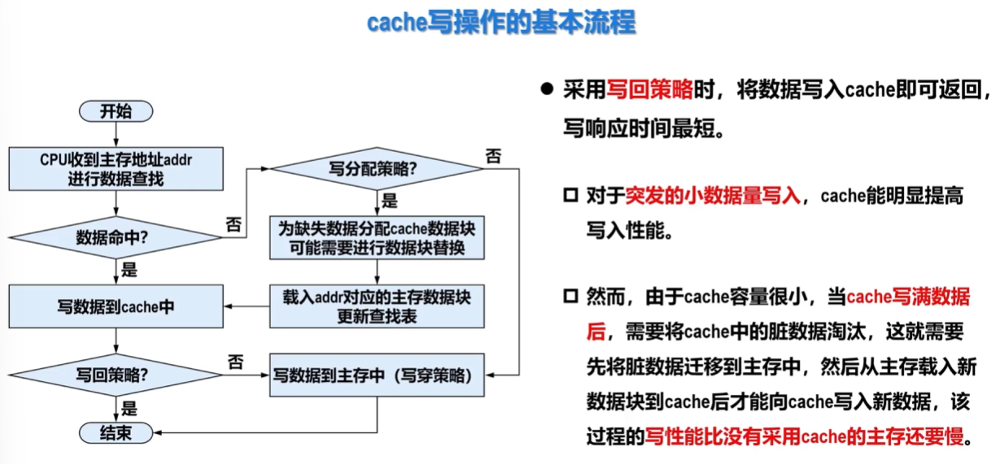
脏数据：新写入cache的数据与主存中的原始数据不一致，这部分数据称为脏数据。

## 地址映射—直接映射
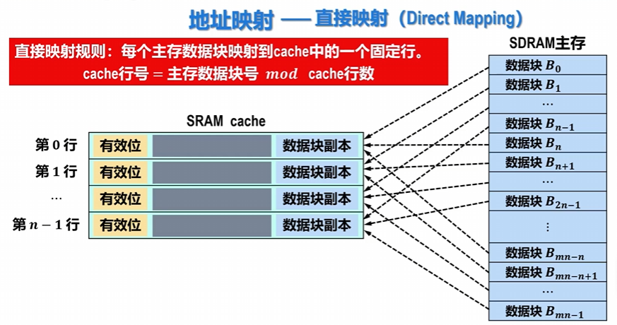
又叫模映射

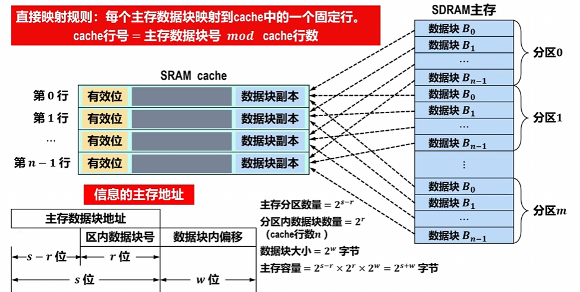

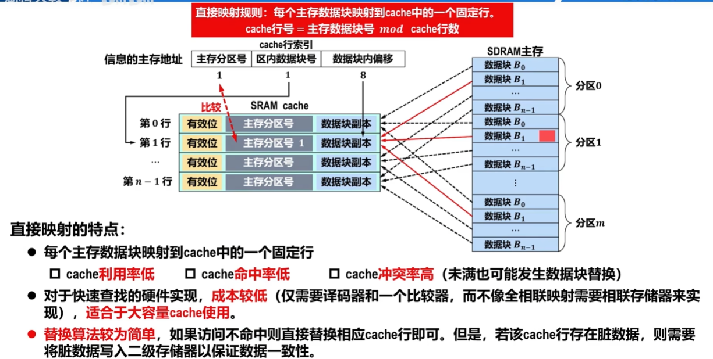

## 地址映射——全相联映射
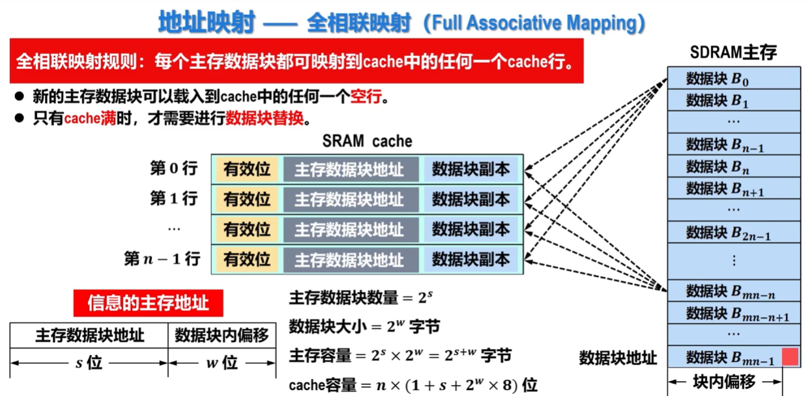
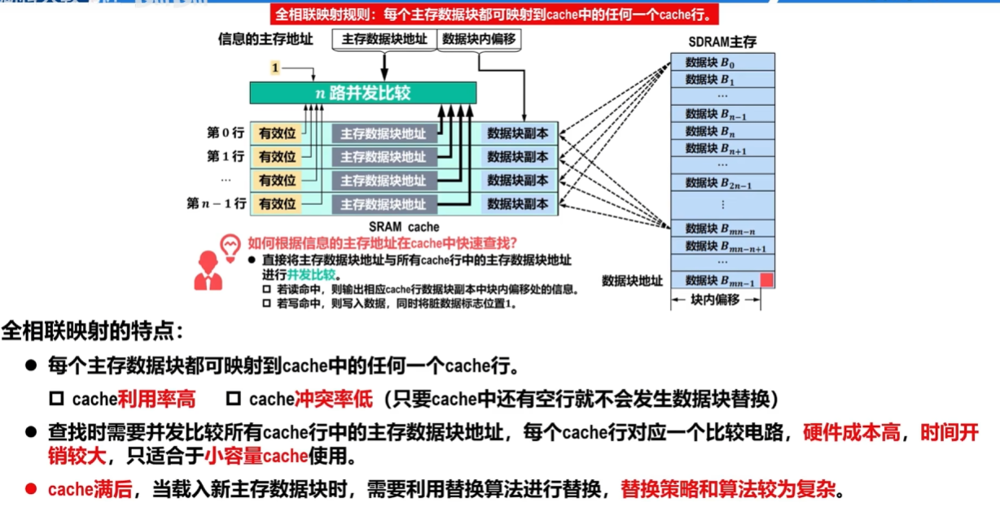

## 地址映射——组相联映射
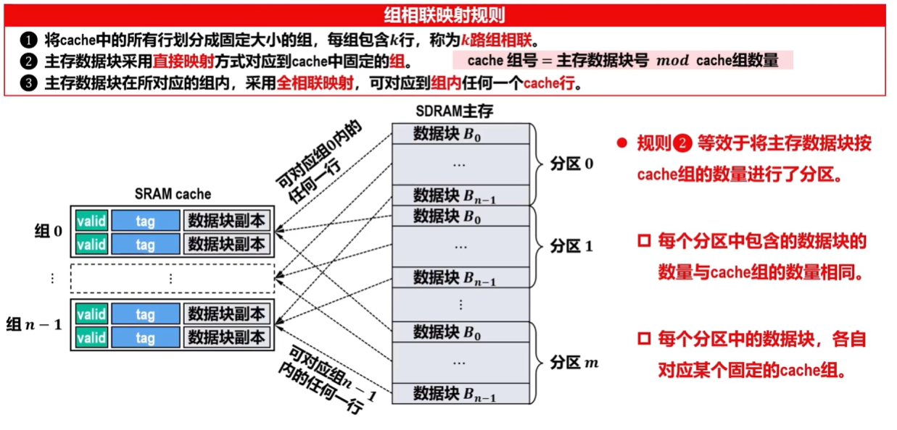
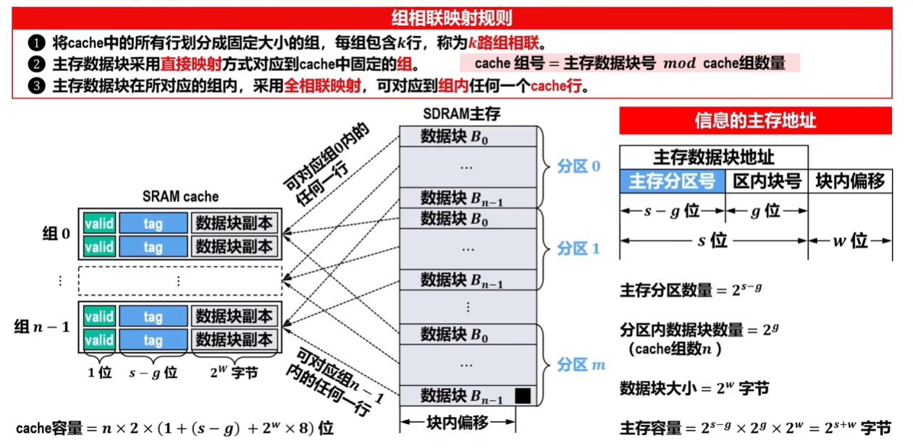
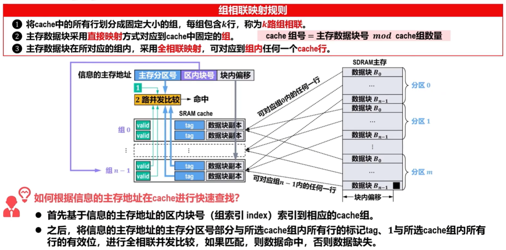

