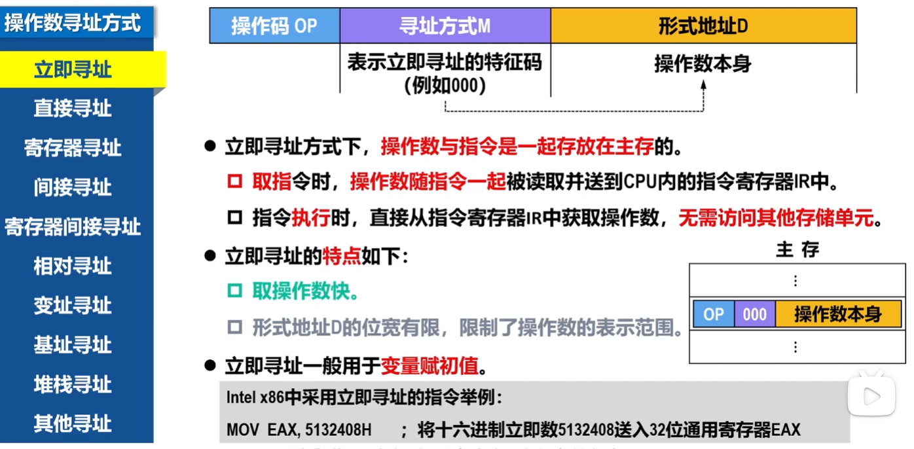
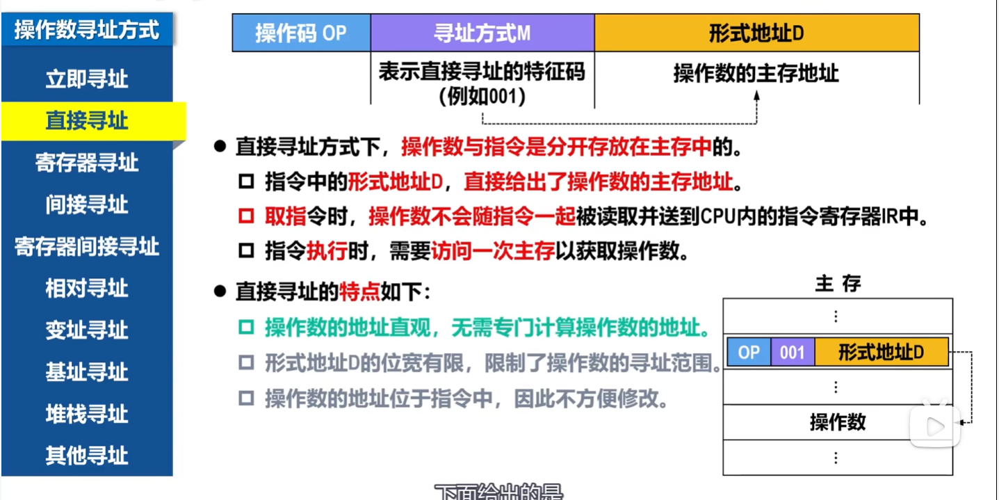
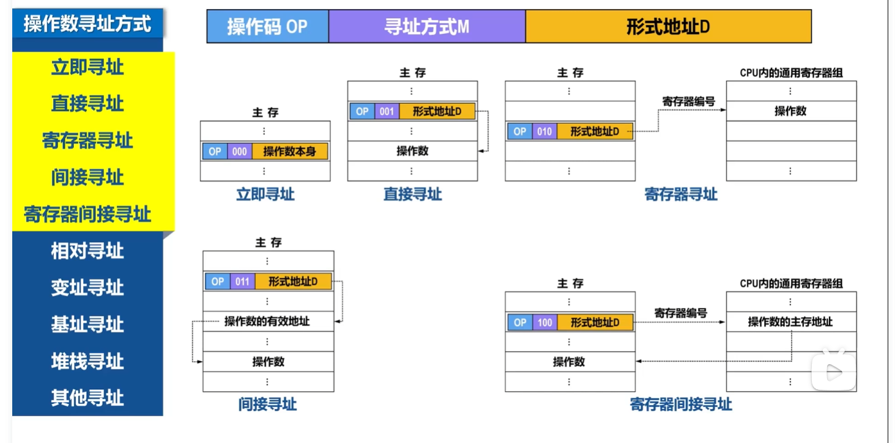

# 寻址方式
寻址方式是指寻找**指令**或**指令中操作数**的有效地址的方式。

## 指令寻址方式

## 操作数寻址方式

### 立即寻址

### 直接寻址

> 他俩最本质的区别是：**指令中的地址字段里装的到底是“数据”，还是“数据的地址”。**
>
> | 寻址方式     | 指令中的地址字段存什么 | 操作数在哪里 |
> | ------------ | ---------------------- | ------------ |
> | **立即寻址** | **操作数本身**         | 指令内部     |
> | **直接寻址** | **操作数的内存地址**   | 主存中       |
>
> 

 可以把这些寻址方式简单记成“**操作数到底在哪里、地址怎么算**”。

| 寻址方式           | 简单理解                                 | 典型形式        |
| ------------------ | ---------------------------------------- | --------------- |
| **立即寻址**       | 操作数直接写在指令里                     | `A = D`         |
| **直接寻址**       | 指令直接给出操作数的内存地址             | `EA = A`        |
| **寄存器寻址**     | 操作数就在寄存器里                       | `A = (R)`       |
| **间接寻址**       | 指令给出的地址里，存的是操作数的真正地址 | `EA = (A)`      |
| **寄存器间接寻址** | 寄存器里存的是操作数的内存地址           | `EA = (R)`      |
| **相对寻址**       | 当前程序位置 PC + 偏移量                 | `EA = (PC) + A` |
| **变址寻址**       | 变址寄存器 + 指令中的地址                | `EA = (IX) + A` |
| **基址寻址**       | 基址寄存器 + 指令中的偏移量              | `EA = (BR) + A` |
| **堆栈寻址**       | 操作数放在栈顶附近，由 SP 指向           | `EA = (SP)`     |
| **其他寻址**       | 一些特殊方式，如隐含寻址等               | 视指令而定      |

其中 `EA` 表示**有效地址**。

最容易混淆的几个，可以这样记：

- **立即寻址**：给我**数据**。
- **直接寻址**：给我**数据的地址**。
- **间接寻址**：给我**地址的地址**。
- **寄存器寻址**：数据在**寄存器**。
- **寄存器间接寻址**：寄存器里放的是**数据的地**

