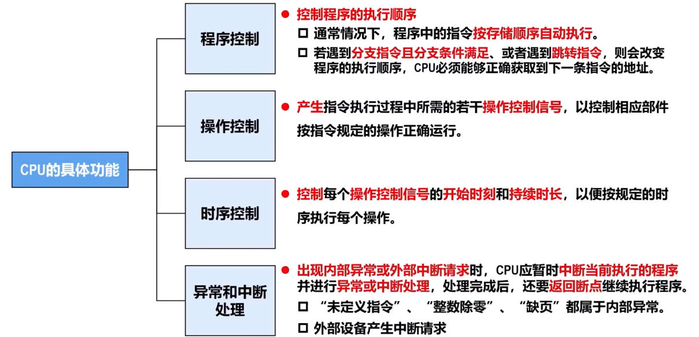
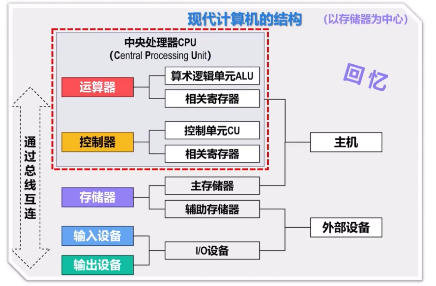
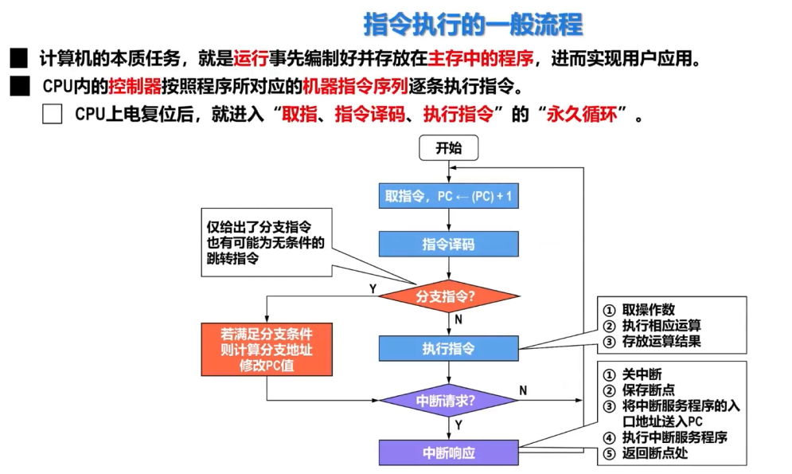
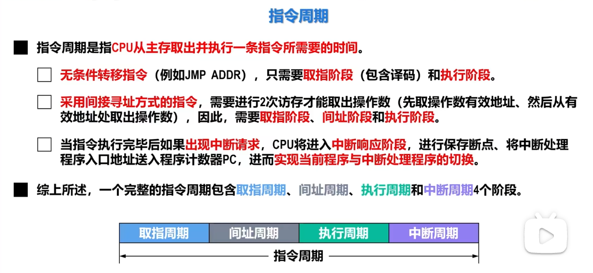
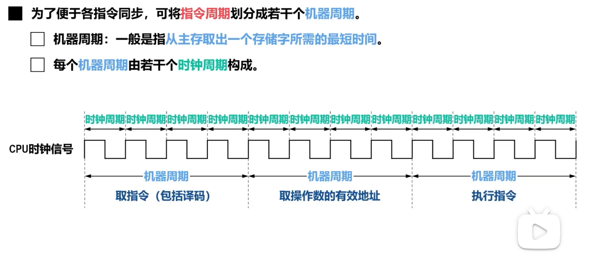
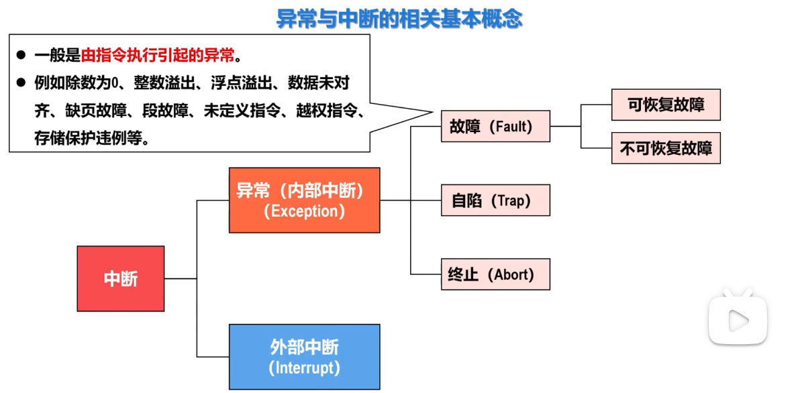

# 中央处理器

## CPU具体功能

## CPU的组成

CPU主要由**运算器**和**控制器**组成

## 指令执行的一般流程

### 指令周期

### 机器周期

## 异常与中断

**故障（Fault）**：执行指令时检测到的、通常可以处理并恢复执行的异常，如缺页故障。

**自陷（Trap）**：程序主动执行特殊指令而产生的异常，常用于系统调用或调试。

**终止（Abort）**：发生严重且无法恢复的错误时产生的异常，通常直接终止当前程序。