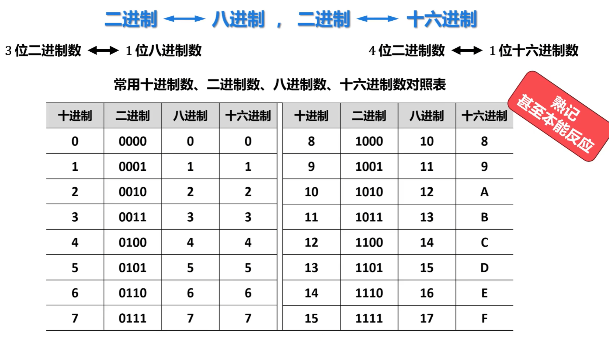

# 进制转换
十进制转二进制，核心方法是：**整数部分除 2 取余，倒着写；小数部分乘 2 取整，顺着写**。

## 十进制整数转二进制

方法：**不断除以 2，记录余数，最后把余数倒过来写**。

例如：
[
13 \div 2 = 6 \余 1
]

[
6 \div 2 = 3 \余 0
]

[
3 \div 2 = 1 \余 1
]

[
1 \div 2 = 0 \余 1
]

通俗记忆：**除 2 取余，余数倒排**。

------

## 十进制小数转二进制

方法：**不断乘 2，取整数部分，顺着写**。

例如：
$$
0.625_{10} = ?_2
$$
取整数部分：1
$$
0.25 \times 2 = 0.5
$$
取整数部分：0
$$
0.5 \times 2 = 1.0
$$
取整数部分：1

所以：
$$
0.625_{10} = 0.101_2
$$
通俗记忆：**乘 2 取整，整数顺排**。

