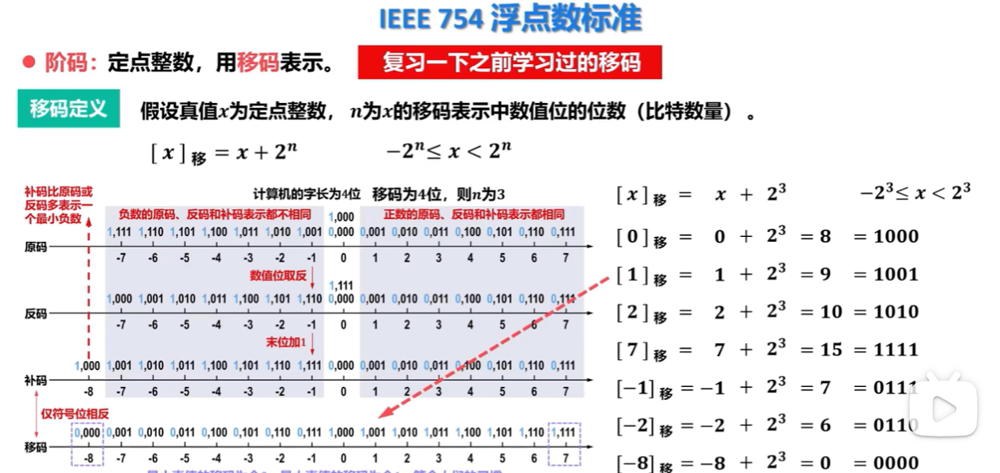

# 原码，补码，反码，移码

以 **8 位、数字 5** 为例：

- **原码**：最高位表示正负，其余位表示数值。
   $+5=00000101$，$-5=10000101$。
- **反码**：正数不变；负数在原码基础上，符号位不变，其余位取反。
   $-5=11111010$。
- **补码**：正数不变；负数等于反码加 1。
   $-5=11111011$。计算机通常使用补码，因为减法可以转化为加法。
- **移码**：在补码基础上，将最高位取反，常用于表示浮点数的阶码。
   $+5$ 的补码是 `00000101`，移码是 `10000101`。

简单记忆：**原码看正负，反码按位反，补码再加一，移码翻符号位。**

下面要记忆一下移码的概念

移码的优点

- 真值0在移码中只有一种表示。

- 移码保持了真值原有的大小顺序，可以直接比较大小。

- 最小真值的移码为全0，最大真值的移码为全1，符合人们的习惯。