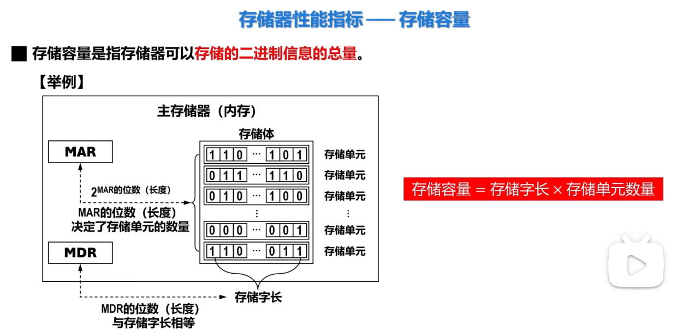
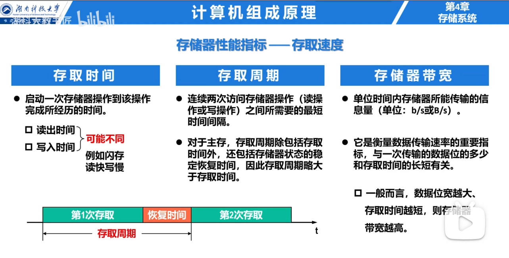
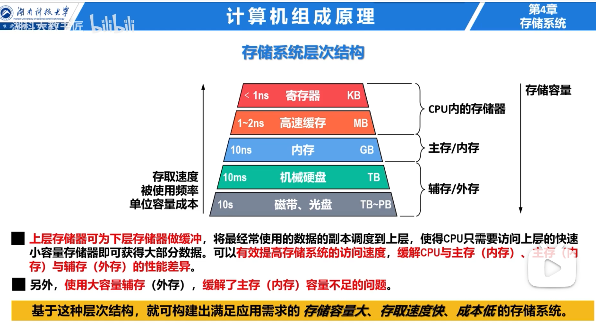
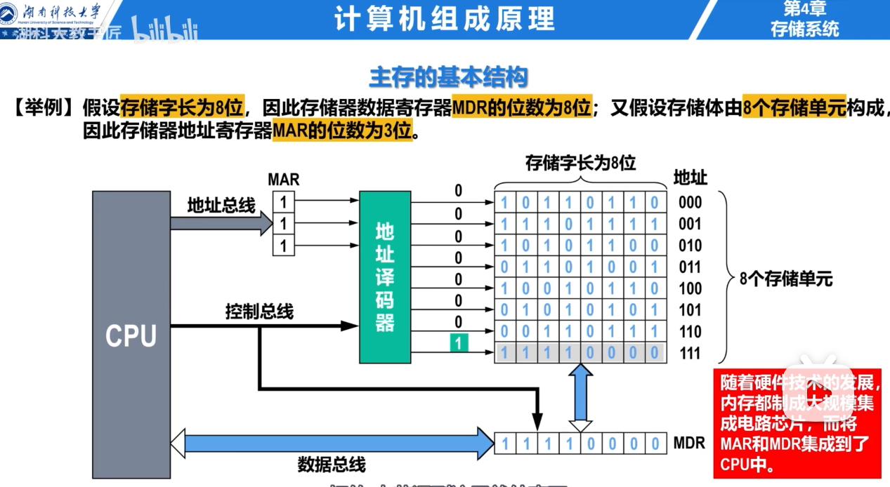

# 存储器的性能指标

- 存储容量
- 存取速度

## 存储容量

**MAR（Memory Address Register，存储器地址寄存器）**

用来存放**当前要访问的存储单元地址**。

可以理解为：告诉内存“我要访问哪一格”。

- MAR 有 $n$ 位，就能表示 $2^n$ 个不同地址。
- 因此，**MAR 的位数决定存储单元的数量**。

例如：MAR 为 16 位，可以寻址 $2^{16}=65536$ 个存储单元。

------

**MDR（Memory Data Register，存储器数据寄存器）**

用来暂时存放**从内存读出的数据，或准备写入内存的数据**。

可以理解为：负责在 CPU 和内存之间“搬运数据”。

- 读内存：内存数据先进入 MDR，再交给 CPU。
- 写内存：CPU 先把数据放入 MDR，再写入内存。
- **MDR 的位数通常与存储字长相等**。

例如：MDR 为 32 位，说明一次通常可以读写 32 位数据。

## 存期速度

包含
- 存取时间
- 存取周期
- 存储器带宽

## 存储系统的层次结构

## 主存的基本结构

